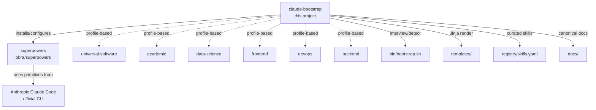
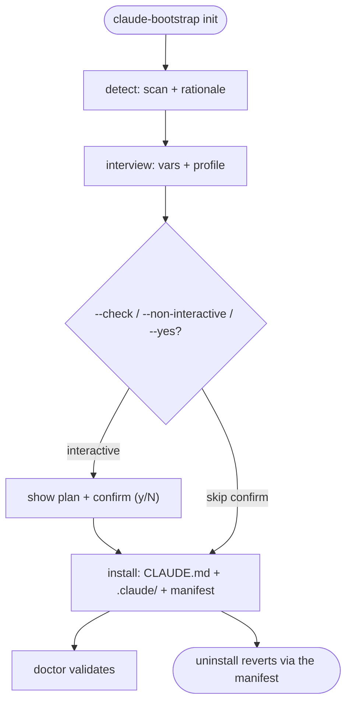

# Overview — `claude-bootstrap`

> The project at a glance. For the official Anthropic standard see [`01-canonical-anthropic.md`](01-canonical-anthropic.md); for the community state of the art see [`02-state-of-the-art.md`](02-state-of-the-art.md).
>
> 🇧🇷 [Versão em português](pt-br/00-overview.md)

---

## 1. What it is

`claude-bootstrap` is a **universal bootstrap framework for Claude Code projects**. Its positioning is explicit: it is a **layer above [`superpowers`](https://github.com/obra/superpowers)** (~270k stars, measured 2026-08-10; a cross-tool lingua franca). It does not compete with it — it declares a dependency on it. The project is a hybrid of:

- **Human-readable docs** (`docs/`) explaining the *why* behind each choice, with source URLs
- **An idempotent Python engine** (the `claude_bootstrap/` package, with `bin/bootstrap.sh` as a thin shell wrapper) automating the *how*

**Current status**: `v1.0.0` — first public release (2026-08-11). The engine is complete, 6 profiles are populated (plus multi-profile support for monorepos), there is a plugin marketplace, and the CI suite is green (the live test count is the README badge). The release process stays documented in [`RELEASE.md`](../RELEASE.md).

---

## 2. Why it exists — the 5 gaps that motivated it

A typical Claude Code operator accumulates several patterns cohabiting on one laptop. The workspace census that motivated this project (2026-05) found four independent zones commonly present, none of them portable:

| Zone | Typical path | Nature |
|---|---|---|
| Global brain | `~/.claude/` | superpowers + framework symlinks |
| Portable agentic stack | `~/.agent/` | episodic/semantic memory + dream cycle |
| Domain workspace | one specific project | `.claude/{commands,rules,skills}/` local to that project |
| Raw library | a collection repo | hundreds of skill subdirectories with no curation |

None of them is portable *and* opinionated *and* current with the 2026-05 state of the art. **Five gaps**:

1. **Domain-specific skills trapped** in the project where they were born, with no path to reuse
2. **No reconciliation** between the agentic stack (`~/.agent/`) and `superpowers` (`~/.claude/`) — primacy is ambiguous
3. **No bootstrap adaptive to project type** (academic, frontend, data-science, devops, backend)
4. **Raw libraries with no curation by tier** — hundreds of skills with no trust criterion
5. **No canonical reference doc** (Anthropic + state of the art) frozen at 2026-05

---

## 3. Architecture — 3 layers

`claude-bootstrap` owns: the **interview/detection wizard**, the **profiles** (universal/academic/…), the **registry of skills curated by tier**, and the **canonical Anthropic + state-of-the-art doc set**.

`superpowers` owns: **modular skills**, **commands**, **methodology**.

Anthropic Claude Code owns: **CLAUDE.md, skills, agents, hooks, MCP, plugins, the settings hierarchy**.

---

## 4. The `claude-bootstrap init` flow

By default `init` prints *why* it picked the profile (a rationale built from
`detect`'s signals) and asks `[y/N]` before writing anything (skipped by
`--check`/`--non-interactive`/`--yes`). A real write records a manifest that
`uninstall` uses to revert safely, preserving files the user edited. The detailed
flow is in [`06-bootstrap-flow.md`](06-bootstrap-flow.md) §2.

### What `detect.py` infers

| Signal | Inference |
|---|---|
| `package.json` + `tsconfig.json` | profile `frontend` |
| `package.json` alone, or `Cargo.toml` | profile `universal-software` (the fallback — there is no `node` or `rust` profile) |
| `pyproject.toml` / `requirements.txt` / `setup.py` | profile `data-science` if a DS keyword is present (`pandas`, `torch`, …), otherwise `universal-software` |
| `*.tf`, Helm `Chart.yaml`, or a `Dockerfile` plus an IaC directory | profile `devops` |
| `*.tex`; or `*.bib`/`*.csl` with no code project | profile `academic` |
| `.claude/` already present | update mode, customisations preserved |
| `~/.agent/` referenced | enables agentic-stack interop |
| `superpowers` under `~/.claude/skills/` | dependency satisfied |

Only `backend` is missing from that summary, because it needs a web-framework
marker rather than a file signature. The authoritative table — full priority
order, confidences, and the monorepo union — is
[`05-profiles.md`](05-profiles.md) §3 and §10; this one is a summary and
deliberately does not restate the numbers.

---

## 5. Non-negotiable principles

1. **Idempotent** — re-running `init` on an already-configured project breaks nothing
2. **Detective before prescriptive** — `detect.py` scans before `interview.py` asks
3. **Profile-based, not monolithic** — adding a new profile is zero-touch for existing ones
4. **Document the why** — `docs/` cites sources with URLs
5. **Compatible with superpowers** — declares a dependency, does not duplicate primitives
6. **Zero hallucinated references** — every recommendation carries a verifiable source URL
7. **CLAUDE.md ≤ 60 lines where possible (~140-150 max)** — beyond that, split into `.claude/rules/<scope>*.md` (path-scoped, the Anthropic Q2/2026 pattern)

---

## 6. The 8-phase roadmap

| # | Phase | Description | Status |
|---|---|---|---|
| 0 | Final decisions | Socratic kickoff session | ✅ Done (2026-05-05) |
| 1 | Skeleton + canonical docs | `docs/00–02`, repo structure | ✅ Done (2026-05-05) |
| 2 | Jinja `_base/` templates | `CLAUDE.md.j2`, `PROJECT-STATE.md.j2`, `settings.json`, `.gitignore` | ✅ Done |
| 3 | Bootstrap engine | `claude_bootstrap/{cli,interview,detect,install,uninstall,doctor,skill}.py` (+ the `bin/bootstrap.sh` wrapper) | ✅ Done |
| 4 | Profiles | 6 populated: `universal-software`, `academic`, `frontend`, `data-science`, `devops`, `backend` | ✅ Done |
| 5 | Registry + superpowers | `registry/skills.yaml` (13 skills) + `claude-bootstrap skill` | ✅ Done |
| 6 | End-to-end validation | profile audits + wheel/init E2E | ✅ Done |
| 7 | Populated profiles + docs | 30 bundled skills across 6 profiles (25 curated from third parties + 5 first-party) + `docs/00–08` | ✅ Done |
| 8 | Hardening | `tests/` (pytest suite), GitHub Actions CI, pre-commit, marketplace, weekly `skill-drift.yml` | ✅ Done |

> [!NOTE]
> This 8-phase kickoff roadmap is **complete**. The work that followed — schema
> currency, pinned provenance, i18n and the publication gate — is tracked in
> [`CHANGELOG.md`](../CHANGELOG.md) and [`RELEASE.md`](../RELEASE.md).

---

## 7. Repo structure

- `README.md`, `README.pt-br.md`, `AGENTS.md`, `CLAUDE.md`, `LICENSE`, `CHANGELOG.md`
- `pyproject.toml` — packaging + pytest/ruff config
- `.claude-plugin/marketplace.json` — the plugin marketplace
- `claude_bootstrap/` — the Python package (the engine)
  - `cli.py` — dispatcher: `init|update|uninstall|detect|doctor|skill`
  - `interview.py`, `detect.py`, `install.py`, `uninstall.py`, `doctor.py`, `skill.py`, `audit.py`
  - `registry/skills.yaml` — the 13-skill registry
  - `templates/_base/` — `CLAUDE.md.j2`, `PROJECT-STATE.md.j2`, `.claude/`, `.gitignore`
  - `templates/profiles/<name>/` — one directory per profile, each with `profile.yaml`, `skills/`, `NOTICE.md`, `.claude-plugin/plugin.json`
- `bin/bootstrap.sh` — thin shell wrapper over the package
- `docs/` — this set, `00–08`, in English; `docs/pt-br/` mirrors it in Portuguese
- `tests/` — the pytest suite (`test_{cli,install,uninstall,detect,doctor,skill,interview,…}`; the live count is the README tests badge)
- `scripts/` — `pii-scan.py`, `verify-skill-provenance.py`, `verify-wheel-tracked.py`, `validate-refs.sh`, …
- `.github/workflows/` — `ci.yml`, `release.yml`, `skill-drift.yml`, `demo.yml`

---

## 8. Principles inherited from academic rigour

The project was born in an academic-writing context and inherited the standards that became its defaults:

- **Zero hallucinated references** — every recommendation cites a verifiable URL
- **Opinionated style** — English is the canonical language of this doc set, with the Portuguese translation mirrored under `docs/pt-br/`; identifiers, commands and types stay in English in both
- **Typora-friendly GFM output** — pipe tables, callouts, mermaid; no ASCII art
- **Restricted Bash permissions** by default — the `_base` settings allow read-only tools (`ls`, `cat`, `grep`, `rg`, `find`, `wc`, `head`, `tail`, `stat`, `file`, `diff`, `tree`, `jq`) and read-only git (`status`, `diff`, `log`, `show`), nothing that mutates
- **Plan mode by default** when a task takes 3+ steps
