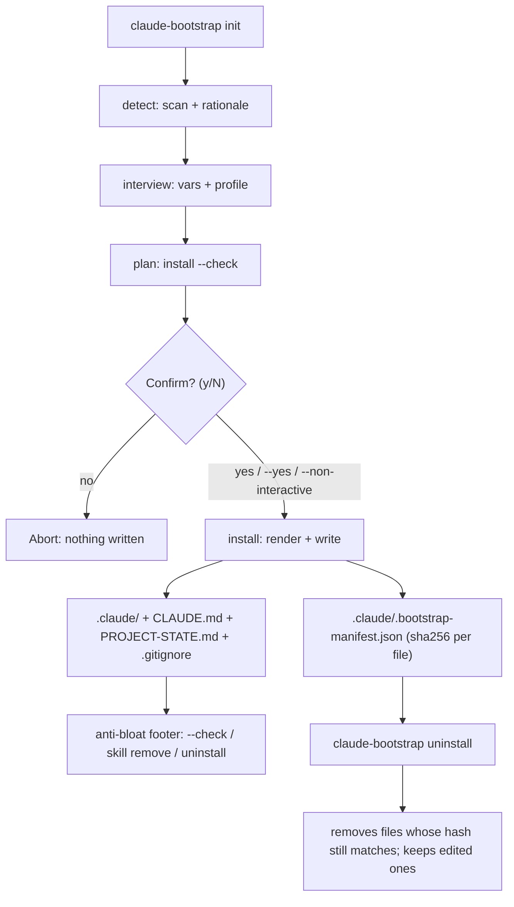

# Profile system — `claude-bootstrap`

> A profile is an opinionated bundle of skills + rules + settings overrides for one kind of project. Adding a new profile is zero-touch for every existing one (the *profile-based, not monolithic* principle). Every claim about engine behaviour below was measured against this repo's own code on 2026-07-30.
>
> 🇧🇷 [Versão em português](pt-br/05-profiles.md)

---

## 1. The `profile.yaml` schema

Each profile lives in `templates/profiles/<name>/profile.yaml`. Recognised fields:

| Field | Type | Required | Description |
|---|---|---|---|
| `name` | string | yes | Profile identifier (same as the directory name) |
| `description` | string | yes | Free text shown in the interview |
| `version` | string | yes | Profile SemVer (e.g. `1.0.0`) |
| `language` | string | no | Main language (`en`, `pt-br`, …) |
| `skills` | list | no | Bundled skill names — subdirectories of `skills/` |
| `rules` | list | no | Bundled rule files — files in `rules/` |
| `agents` | list | no | Bundled subagent files — files in `agents/` |
| `output_styles` | list | no | Bundled output-style files — files in `output-styles/` (note the hyphen in the directory, the underscore in the field) |
| `settings_overrides` | object | no | Extra permissions and env vars (see §5) |
| `based_on` | string | no | **Declarative lineage marker only. No code and no test reads it** — see §8 before using it |

Minimal example (`universal-software`, the default profile):

```yaml
name: universal-software
description: >
  Default general-purpose profile for Claude Code projects. Bundles first-party skills
  authored in this repository (see NOTICE.md), complements rather than replaces
  superpowers (declared dependency), and lets the user/project add path-scoped rules
  in .claude/rules/ as needed.
version: 1.0.0
language: en
skills:
  - newproj
  - ponytail
  - recover
  - refactor
  - vetting-agent-skills
rules: []
settings_overrides: {}
```

Fuller example (`academic`), showing rules, an output style and permission overrides:

```yaml
name: academic
description: >
  Profile for academic / scientific writing projects (papers, theses, posters,
  bibliographies, peer-review prep).
version: 1.0.0
language: en
skills:
  - citation-management
  - exploratory-data-analysis
  - exa-search
rules:
  - latex.md
output_styles:
  - concise-academic.md
settings_overrides:
  permissions:
    allow:
      - "Bash(pandoc *)"
      - "Bash(latexmk *)"
```

---

## 2. Profile lifecycle: detect -> confirm -> install -> uninstall

The whole cycle is exposed by the `claude-bootstrap` CLI, which orchestrates the
`detect` / `interview` / `install` / `uninstall` modules in `claude_bootstrap/`.



Properties of the cycle, all verifiable in `claude_bootstrap/cli.py`:

- **Detection rationale (A6)**: `init` prints *why* it picked the profile — the
  signals `detect` found — rather than raw JSON.
- **Confirm before write (A4)**: by default `init`/`update` show the plan
  (`install --check`) and ask `[y/N]` before writing anything. Skipped by
  `--check`, `--non-interactive` (CI) and `--yes`.
- **Manifest (A5)**: every write records `.claude/.bootstrap-manifest.json`
  (sha256 per file + the managed `.gitignore` lines), deterministically.
- **Uninstall (A5)**: `claude-bootstrap uninstall` reads the manifest, removes
  only files whose hash still matches, **keeps the edited ones** and reverts the
  `.gitignore`.

The full flow is detailed in `06-bootstrap-flow.md`.

---

## 3. Profile selection: interview / detect

### Interactive interview

`claude_bootstrap/interview.py` lists the active profiles under `templates/profiles/` and shows `detect`'s suggestion as the pre-selected default. The operator confirms it or picks another. Under `--non-interactive` it uses defaults with no prompts.

### Detection heuristics (`claude_bootstrap/detect.py`)

Top-down priority — the first rule that matches wins (`infer_profile()`):

| Priority | Signal detected | Suggested profile | Confidence |
|---|---|---|---|
| 1 | Any `*.tex`; or `*.bib` with no code project; or `*.csl` outside a software project | `academic` | 0.95 |
| 2 | `Cargo.toml` | `universal-software` (rust fallback) | 0.60 |
| 3 | `pyproject.toml` / `requirements.txt` / `setup.py` + a data-science keyword (`pandas`, `torch`, `tensorflow`, `scikit-learn`, `jupyter`, `numpy`) | `data-science` | 0.85 |
| 4 | `pyproject.toml` / `requirements.txt` / `setup.py` with no DS keyword | `universal-software` | 0.70 |
| 5 | `package.json` + `tsconfig.json` | `frontend` | 0.85 |
| 6 | `package.json` without `tsconfig.json` | `universal-software` | 0.70 |
| 7 | Any `*.tf` or Helm `Chart.yaml` (recursive); or a `Dockerfile` plus a directory matching `terraform`/`ansible`/`kubernetes`/`k8s*`/`helm`/`charts`/`manifests`/`deploy(ment)s` | `devops` | 0.80 |
| 8 | No signal | `null` | 0.00 |

Two asymmetries worth knowing, both deliberate. `.tex` alone is enough for `academic`, while a bare `.bib` or `.csl` is not: scientific Python libraries routinely ship a `paper.bib`, and doc pipelines vendor a `.csl` next to real source, so those two only count when there is no code project to hijack. And `devops` is checked **last** despite being the strongest structural signal, because a repo that has both a language stack and IaC is better served by the language profile.

`detect`'s JSON output also carries `signals` (the readable list used in `init`'s rationale), `mode` (`init` vs `update`), `superpowers_available` and `agentic_stack_interop` — informational fields for the interview, not inputs to profile selection. On a monorepo it additionally carries `profiles` and `stack_paths`; see §10.

---

## 4. Profile install: `install_profile_assets()`

`install_profile_assets()` in `claude_bootstrap/install.py`. Flow:

1. Load `profile.yaml` via `load_profile()`.
2. For each entry in `skills[]`:
   - Source: `templates/profiles/<name>/skills/<skill_name>/`
   - Target: `<target>/.claude/skills/<skill_name>/`
   - Copies every file recursively with **create-only** semantics.
3. For each entry in `rules[]`, `agents[]` and `output_styles[]`:
   - Source: `templates/profiles/<name>/{rules,agents,output-styles}/<file>`
   - Target: `<target>/.claude/{rules,agents,output-styles}/<file>`
   - Copies with **create-only** semantics. A declared file that is missing on
     disk is reported as `source-missing` rather than failing the run.
4. If the profile has `subdir-examples/<subdir>-CLAUDE.md`, it is installed at
   `<target>/<subdir>/CLAUDE.md` (the per-subdirectory CLAUDE.md mechanism).
   These static examples are **suppressed in multi-profile mode** — §10 explains why.

Beyond the profile assets, `install.main()` renders `CLAUDE.md`,
`PROJECT-STATE.md` and `.claude/settings.json` (with `settings_overrides`
applied — see §5) and soft-merges the `.gitignore`. At the end of a real write it
records the **manifest** `.claude/.bootstrap-manifest.json` (sha256 of every
emitted file + the managed `.gitignore` lines), which `uninstall` consumes.

**Idempotence**: create-only semantics (in `install_create_only()`) guarantee that re-running without `--force` never overwrites the user's edits. Per-file status is one of `created`, `exists-skipped`, `overwritten`, `unchanged`, `diverged (.new)` (in `--update` mode), or the `would-*` equivalents under `--check`. The manifest is deterministic, so re-running with the same vars reports every file as `unchanged`.

**`--force`**: overwrites existing files. Use with care — it erases local customisations.

**`--check`**: full dry run. Reports what would be done without writing anything (and without recording a manifest).

**`--update`**: for diverged files, writes `<path>.new` instead of skipping. The
`.new` file is recorded in the manifest with its own hash, so `uninstall` removes
it too — as long as it is still unmodified. A `.new` the user has edited fails the
hash check and is kept, like any other edited file.

Install output is JSON with a list of `actions` (`file`, `status`), which makes auditing and CI straightforward.

---

## 5. `settings_overrides`

The `settings_overrides` field in `profile.yaml` describes two sub-blocks:

```yaml
settings_overrides:
  permissions:
    allow:
      - "Bash(pandoc *)"   # extra permission merged into settings.json
    deny:
      - "Bash(terraform destroy *)"  # devops denies destructive operations
  env:
    MY_VAR: "value"        # variable injected into .claude/settings.json (env)
```

**Implemented** (`merge_settings_overrides()` in `install.py`, exercised by
`test_settings_overrides_merged_for_*`). The merge is deep, with per-type rules:

- **dict + dict**: recursion (profile keys extend or override the base ones).
- **list + list**: concatenates base + profile and **dedupes preserving order** (e.g. `permissions.allow`).
- **scalar**: the profile wins.

The result is written to `<target>/.claude/settings.json`. Profiles like `devops`
use this to allow `terraform plan`/`kubectl get` and deny `terraform
destroy`/`kubectl delete`; `universal-software` ships `settings_overrides: {}`
(so `env` stays empty).

For the permission schema itself, see `01-canonical-anthropic.md` §2 (Skills standard) and `04-skills-curated.md` (skills with documented permissions).

---

## 6. Available profiles (v1.0.0)

| Profile | Bundled skills | Skill upstream | Status |
|---|---|---|---|
| `universal-software` | 5 | — first-party (authored in this repo, MIT) | ✅ default |
| `academic` | 3 | 3 `K-Dense-AI/scientific-agent-skills` (MIT) | ✅ ready |
| `data-science` | 6 | 6 `alirezarezvani/claude-skills` (MIT) | ✅ ready |
| `frontend` | 7 | 3 `anthropics/skills` (Apache-2.0) + 4 `alirezarezvani/claude-skills` (MIT) | ✅ ready |
| `devops` | 5 | 5 `alirezarezvani/claude-skills` (MIT) | ✅ ready |
| `backend` | 4 | 4 `alirezarezvani/claude-skills` (MIT) | ✅ ready |

Every profile that bundles skills carries a `NOTICE.md` with per-skill provenance,
licence, and — for third-party content — the pinned upstream commit. The bundle is
content-verified by `scripts/verify-skill-provenance.py`: **30 skills, 0 DIFFERS**,
split 17 EXACT + 8 WS-ONLY (whitespace-only difference) + 5 FIRST-PARTY.

Read those three verdicts as different strengths of evidence, not as one. EXACT and
WS-ONLY are byte comparisons against a specific upstream commit. FIRST-PARTY only
asserts that the `SKILL.md` exists, because a skill authored here has no upstream to
compare against — inherent to the class, not a gap in the tool.

A pinned commit is a fixed point, so upstreams do move past it; that is what the pin
is for. `verify-skill-provenance.py --check-currency` reports which pins have fallen
behind upstream `HEAD`, and `.github/workflows/skill-drift.yml` runs the check weekly.
A `STALE` verdict there means "upstream advanced", never "the bundled content
changed" — bundled content is what the byte comparison above covers.

The `backend` profile is **config-only**: it detects the stack and emits
guidance, permissions, skills and rules, but **never installs dependencies**. The
real guarantee is tool-side rather than advisory — `install.py` shells out to no
package manager.

De-bundled so far: `xlsx`, `senior-devops` and `theme-factory` (2026-06-06, content
misfits); `release-manager` (2026-06-29, removed from upstream `HEAD`, so it can no
longer be provenance-verified); and `doc-coauthoring`, `pdf`, `pptx`, `docx`
(2026-07-26, **no licence permitting redistribution** — see
`templates/profiles/academic/NOTICE.md`).

---

## 7. How to add a new profile

```
1. mkdir templates/profiles/<name>/
2. Write a minimal profile.yaml (name, description, version required)
3. Optional: add skills/  (subdirectories with a SKILL.md) + a NOTICE.md for provenance
4. Optional: add rules/, agents/, output-styles/ and subdir-examples/<subdir>-CLAUDE.md
5. Register the heuristic in claude_bootstrap/detect.py (infer_profile function)
6. Register it in the interview in claude_bootstrap/interview.py (PROFILES list)
7. Test: claude-bootstrap init --target /tmp/fixture --profile <name> --check
```

Quick check of the heuristic:

```bash
claude-bootstrap detect /tmp/fixture
```

The JSON output should show `"profile_suggestion": "<name>"` at the expected confidence. The profile should also appear in the interactive interview. Add a `test_init_with_<name>_profile` test mirroring the existing ones in `tests/test_install.py`.

---

## 8. Composition — `_base/`, not `based_on`

> [!IMPORTANT]
> **This section asserted the opposite until 2026-07-30.** It used to open with "the
> `based_on` field declares inheritance between profiles" and describe asset inheritance
> as a planned feature. Measured against this repo's code: `based_on` is read by **no code
> and no test** — `git grep based_on -- claude_bootstrap/ tests/ scripts/` returns only the
> five `profile.yaml` files that declare it. It is inert. If you arrived here from a cached
> copy of the old text, this version is the correct one. The same correction landed in
> `03-anti-patterns.md` item 10.

Composition is real, and it comes from `_base/`.

`install.py` resolves `<templates_dir>/_base` (`install.py:525`) and applies it for
**every** profile; the profile then layers on top. There is no merge between sibling
profiles: `profile.get("skills")` is read straight from that profile's own file. So the
working rule is that anything universal belongs in `_base/`, and a profile declares only
its delta. This is exactly what makes adding a profile zero-touch for the others —
nothing merges across siblings, so nothing can break across siblings.

`settings_overrides` (§5) is also a real merge, but against the rendered base settings —
not against a parent profile named by `based_on`.

**What to do about `based_on` itself**: five profiles declare `based_on:
universal-software`, and it is accurate as documentation of intent — it records lineage
for a human reader. Treat it as exactly that, and never write a profile whose assets
depend on it resolving. If a profile needs another's content today, copy the assets you
need into the new profile's directory explicitly.

---

## 9. Profile anti-patterns

- **Restating universal configuration in every profile**: if each specialised profile repeats the shared baseline, one universal change means N edits and the copies drift. Put universal content in `_base/` and let the profile carry only its delta. (This is `03-anti-patterns.md` item 10, from the profile side.)
- **Writing a profile that depends on `based_on` resolving**: the field is inert (§8). A profile that omits skills or permissions expecting to inherit them from `universal-software` installs incomplete, with no error.
- **Absolute hard-coded paths in skills**: skills must use relative paths or context variables. Paths like `/home/user/project/` break on every other machine.
- **A monolithic profile with dozens of unrelated skills**: this violates separation by domain. Prefer focused profiles, and share the common floor through `_base/`.
- **Bundling a copy of a skill superpowers already provides globally**: duplicating it creates silent divergence between the two copies. `universal-software` deliberately bundles only skills authored here — five of them, none of which exists upstream in superpowers.
- **Editing `_base/` for one profile's behaviour**: `_base/` is shared by every profile, so a change there reaches all of them. Domain customisations belong in `templates/profiles/<name>/`.
- **Testing a profile only with `--check`**: `--check` validates what would be done but executes nothing. Always test against a real `--target /tmp/fixture` before proposing a profile as ready.

For general skill and rule anti-patterns, see `03-anti-patterns.md`.

---

## 10. Multi-profile: monorepos (Model A — union + per-subdir)

A single-stack repo gets **one** profile. A **monorepo** with several stacks in
sub-projects (say `frontend/` React + `backend/` FastAPI + `infra/` terraform) gets the
**union** of the code stacks detected.

**Discovery (detect).** `infer_profiles()` enumerates sub-projects in a bounded,
convention-driven way — root + immediate children + one level under
`apps|packages|services|libs/*` + workspace globs (`package.json#workspaces`,
`pnpm-workspace.yaml`) — with a prune list (`node_modules`, `examples`, `fixtures`,
`template`, …). Each directory resolves to a profile via `detect_stack(dir)`; the result
is `profiles: sorted(set)` + `stack_paths: {profile: [concrete-dir, …]}`. `detect.json`
keeps `profile_suggestion = profiles[0]` for back-compat.

**Membership rules.** Code stacks are `frontend`, `data-science`, `devops`, `backend`.
`academic` is **exclusive** (a whole-repo domain — returned alone, with no discovery
pass). `universal-software` and the rust/node fallbacks **never** join a union; they
appear only when no positive code stack matches. `backend` requires a **web-framework
marker** (FastAPI/Flask/Django/Express/NestJS/Rails/Spring/…); a genuinely
frameworkless backend stays `universal-software`, a documented limitation. The
backend↔data-science tie-break: strong ML signals (`torch`/`tensorflow`) win for
data-science even alongside a framework, while `numpy`/`pandas` plus a framework
resolves to backend.

**Emission (Model A + per-subdir — both).**

- **Root union** (`.claude/`): merged permissions (sorted iteration → byte-stable),
  **all** skills from every selected profile (with same-name/different-content collision
  detection — never silent), and one `rules/<stack>.md` per profile whose `paths:` is
  derived from the concrete directories in `stack_paths` (`<dir>/**`).
- **Per-subdir**: one thin `<dir>/CLAUDE.md` per discovered sub-project, riding Claude
  Code's native on-demand subtree loading (it loads when Claude works on files in that
  directory, not on `cd`). The root is always filtered out, so it never overwrites the
  union `CLAUDE.md`. In multi mode the static `subdir-examples` (fixed names) are
  **suppressed**.
- **Settings and skills stay at the root only** — `settings.json` does not cascade per
  subdirectory (confirmed against the official docs); only the per-subdir `CLAUDE.md` is
  directory-scoped.

**Caveat on `paths:` rules.** A known upstream bug (#23478) means path-scoped rules fire
on Read, not on Write/create. The per-subdir `CLAUDE.md` shares the **same** trigger class
(it loads when a file in the subtree is read), so both layers are best-effort: the
per-subdir layer earns its place through directory-scoped guidance and structural
tidiness, not through any verified reliability edge over the rules.

**Single-profile byte-identity.** Everything above is additive: a single-stack repo emits
exactly what it emitted before (singular `profile:` footer, no dynamic per-subdir layer,
extension-scoped rules, a scalar `profile` in the manifest). The multi manifest gains
`profiles: [...]` while the scalar `profile` remains for legacy readers;
`audit`/`uninstall`/`doctor` read both.

*Cross-references:* `01-canonical-anthropic.md` §2 (Skills standard) — `03-anti-patterns.md` — `04-skills-curated.md` (registry) — `06-bootstrap-flow.md` (full bootstrap flow) — `07-glossary.md`
