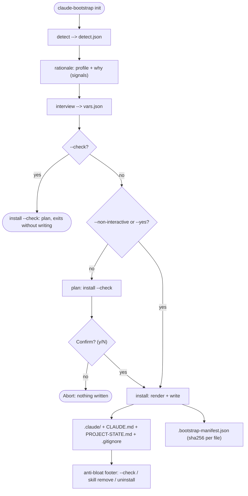
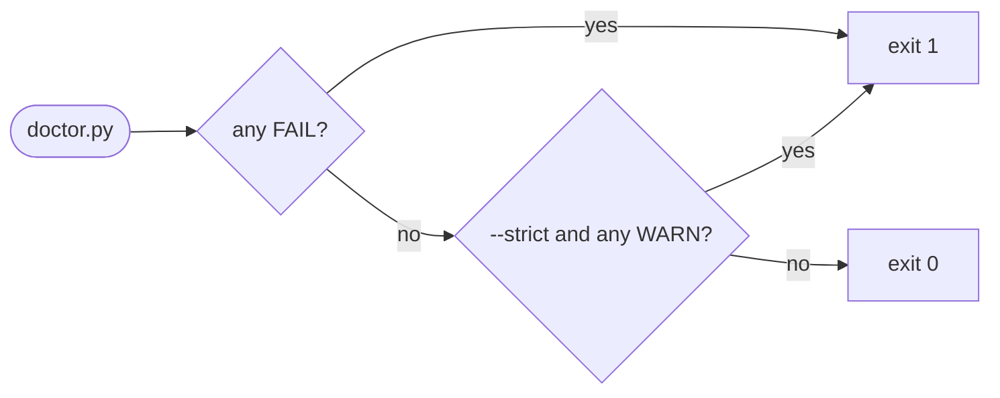
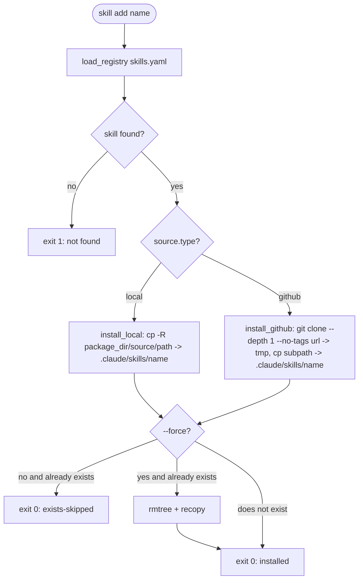

# Engine flow — `claude-bootstrap`

> Operational detail of every subcommand. The engine is the `claude_bootstrap/` package;
> `bin/bootstrap.sh` is a thin wrapper that resolves a Python runner and forwards. Every claim below
> was measured against the code on 2026-08-03.
>
> 🇧🇷 [Versão em português](pt-br/06-bootstrap-flow.md)

---

## 1. Entry point: `bin/bootstrap.sh`

The dispatcher is a Bash script with `set -euo pipefail`. No business logic lives there — it routes
arguments and resolves the runner.

### `pick_python_runner`

Before any subcommand that needs Jinja2/PyYAML, the dispatcher calls `pick_python_runner`:

1. Try `python3 -c "import jinja2, yaml"` — if it works, return `python3`.
2. Otherwise, if `uv` is available, return `uv run --with jinja2 --with pyyaml --no-project python3`.
3. Otherwise, abort with exit code 3 and an install instruction.

> [!NOTE]
> `detect.py` and `doctor.py` are always called with plain `python3` — no optional dependencies.
> `install.py` and `skill.py` go through the runner so Jinja2/PyYAML are present even in an
> environment where nothing was `pip install`ed first.

### Available subcommands

Dispatched by `claude_bootstrap/cli.py`:

| Subcommand | Implemented | Target module |
|---|---|---|
| `init` | Yes | `detect` + `interview` + `install` (with confirm gate + manifest) |
| `update` | Yes | `install --update` (diverged files -> `<path>.new`) |
| `uninstall` | Yes | `uninstall` (reverts one emit via the manifest) |
| `detect` | Yes | `detect` |
| `doctor` | Yes | `doctor` |
| `audit` | Yes | `audit` — provenance + integrity report for an emitted `.claude/` |
| `skill` | Yes | `skill` (list\|show\|add\|remove\|update\|validate) |
| `help` / `-h` / `--help` | Yes | inline |
| `version` / `-V` / `--version` | Yes | inline |

`audit` is the one a regulated or E-E-A-T user attaches to a compliance dossier: exactly what was
emitted, where each skill came from (upstream `repo@SHA`), and its integrity hash reconciled against
the install manifest. It is **offline** — it makes no network call, so the report is a *claim* a
third party re-verifies independently with `scripts/verify-skill-provenance.py`. When the pin file
cannot be resolved (a pip-installed layout where `scripts/` is not adjacent), the SHA is reported as
`null` and the skill as `unpinned`: an audit must say "unknown", never a stale-but-confident SHA.

---

## 2. Subcommand `init`

Orchestrates three stages in sequence, using a `tmpdir` as the data channel between them.

### Flags

| Flag | Type | Default | Effect |
|---|---|---|---|
| `--profile <name>` | string, **repeatable** | auto-detect | Skips the profile question. Passed more than once, the emit is the **union** of those profiles — the multi-profile monorepo case |
| `--target <path>` | string | `.` | Target project |
| `--non-interactive` | bool | false | Uses defaults, no prompts (also skips the confirm gate) |
| `--yes` / `-y` | bool | false | Skips the confirm-before-write, keeps the interview |
| `--force` | bool | false | Overwrites existing files |
| `--check` | bool | false | Dry-run — reports the plan without writing (no manifest) |
| `--tier <lax\|strict>` | choice | `lax` | Permission tier of the emitted `settings.json` |
| `--sandbox` | bool | false | Emits the opt-in sandbox block |
| `--hooks` | bool | false | Emits the opt-in conservative hooks bundle (PreToolUse warn + skill-dispatch) |
| `--fallback-model` | bool | false | Emits the opt-in `fallbackModel` (model resilience) |

> [!WARNING]
> `--tier` means two different things on two subcommands. Here it is the permission tier
> (`lax`/`strict`); on `skill list --tier` it is the registry tier (`1`/`2`/`3`). Same word, unrelated
> axes.

### `init` flow diagram



`claude_bootstrap/cli.py` orchestrates `detect` -> `interview` -> `install` through a `tmpdir`.
`detect` is rendered as a readable **rationale**, there is a **confirm-before-write** `[y/N]` by
default (skipped by `--check` / `--non-interactive` / `--yes`), and the write records the
**manifest** that `uninstall` consumes.

**Variables produced by `interview.py`** (written to `vars.json`):

```
project_name, project_description, primary_language, is_monorepo,
git_remote, profile_name, superpowers_available, agentic_stack_interop,
extra_rules, generated_at, bootstrap_version,
tier, sandbox, hooks, fallback_model
```

`is_monorepo` is not asked in non-interactive mode — it is derived from whether more than one
`--profile` was given.

---

## 3. Subcommand `detect`

Direct call: `bootstrap.sh detect [path] [--output FILE] [--quiet]`

`detect.py` is **read-only** — it writes nothing into the target project.

### `infer_profile` heuristics (in priority order)

Two entry points exist and they are not interchangeable: `infer_profile` scores **one** directory,
and `infer_profiles` walks a monorepo and returns the union across its subdirectories. `academic` is
exclusive — returned alone, never unioned with a code stack.

| # | Signal detected | Suggested profile | Confidence |
|---|---|---|---|
| 1 | `*.tex` (alone this is enough), or `*.csl` / `*.bib` with no code project | `academic` | 0.95 |
| 2 | `Cargo.toml` | `universal-software` | 0.60 |
| 3 | `pyproject.toml` / `requirements.txt` / `setup.py` + data-science deps | `data-science` | 0.85 |
| 4 | `pyproject.toml` / `requirements.txt` / `setup.py` (no data science) | `universal-software` | 0.70 |
| 5 | `package.json` + `tsconfig.json` | `frontend` | 0.85 |
| 6 | `package.json` (no `tsconfig.json`) | `universal-software` | 0.70 |
| 7 | `*.tf` **or** `Chart.yaml` (both searched recursively), **or** a Dockerfile plus an IaC/manifests directory | `devops` | 0.80 |
| — | No signal | `null` | 0.00 |

Data-science keywords (looked for inside the dependency files):
`pandas`, `torch`, `tensorflow`, `scikit-learn`, `jupyter`, `numpy`.

Two guards worth knowing, because both encode a real false positive:

- **`.csl` alone does not make a project academic.** A citation style file is also a
  pandoc/Quarto/R-Markdown asset, so the signal is gated on there being no code project.
- **`paper.bib` stays academic on purpose.** It is the standard JOSS submission shape.

`.github/workflows/` plays no part in the `devops` check — a CI directory says nothing about
whether the project *is* infrastructure.

### Output JSON fields

```json
{
  "scanned_path": "/abs/path",
  "profile_suggestion": "academic",
  "profiles": ["academic"],
  "confidence": 0.95,
  "mode": "init",
  "signals": ["2 .tex file(s) found"],
  "superpowers_available": true,
  "agentic_stack_interop": true,
  "scanned_at": "2026-05-05T10:00:00"
}
```

**`mode`**: `"update"` if `.claude/` already exists in the target, `"init"` otherwise.
**`profiles`** is the multi-profile list; `profile_suggestion` is the scalar kept beside it so a
single-profile reader needs no change.

> For the list of available profiles, see [`05-profiles.md`](05-profiles.md).

### Subdirectory `CLAUDE.md` files (hierarchical context)

Since v0.4.0a0 (kept at v1.0.0), `install.py` installs `<subdir>/CLAUDE.md` automatically whenever the active profile
ships a `subdir-examples/<subdir>-CLAUDE.md`:

- `templates/profiles/<profile>/subdir-examples/`
  - `src-CLAUDE.md` -> `target/src/CLAUDE.md`
  - `notebooks-CLAUDE.md` -> `target/notebooks/CLAUDE.md`
  - `infra-CLAUDE.md` -> `target/infra/CLAUDE.md`
  - `manuscript-CLAUDE.md` -> `target/manuscript/CLAUDE.md`

The convention is the whole mechanism: a file named `<subdir>-CLAUDE.md` installs as
`<subdir>/CLAUDE.md`. Claude Code's filesystem walking (see
[code.claude.com/docs/en/memory](https://code.claude.com/docs/en/memory)) loads those files
**on demand**, when Claude is working inside those subdirectories — so they do not bloat the root
context.

Every bundled profile ships one:

| Profile | Subdir example | Scope |
|---|---|---|
| `universal-software` | `scripts/CLAUDE.md` | Hygiene for utility scripts |
| `frontend` | `src/CLAUDE.md` | Component / styling / state conventions |
| `backend` | `app/CLAUDE.md` | Service-layer conventions |
| `data-science` | `notebooks/CLAUDE.md` | Notebook reproducibility |
| `devops` | `infra/CLAUDE.md` | IaC guardrails (plan-before-apply, secrets) |
| `academic` | `manuscript/CLAUDE.md` | Citation / density / IMRAD for manuscripts |

All six bundled profiles ship one, so the fallback path only shows up in a profile you author
yourself: with no `subdir-examples/` directory, `install.py` emits the root `CLAUDE.md` plus the
assets in `.claude/` and nothing else. Nothing errors — the feature is simply absent.

---

## 4. Subcommand `doctor`

Call: `bootstrap.sh doctor [path] [--json] [--quiet] [--strict]`

Runs 13 read-only checks against the target project. `run_checks` in `doctor.py` is the
authoritative order.

### Checks, in order

| # | Check name | Possible status | What it verifies |
|---|---|---|---|
| 1 | `CLAUDE.md exists` | PASS / FAIL | `CLAUDE.md` in the root or in `.claude/` |
| 2 | `CLAUDE.md size ≤150 lines (ideal ≤60)` | PASS / WARN / FAIL | `≤150` PASS; `151-200` WARN; `>200` FAIL |
| 3 | `.claude/ directory exists` | PASS / FAIL | `.claude/` present |
| 4 | `.claude/settings.json valid JSON` | PASS / FAIL | parses without error |
| 5 | `.claude/settings.json has $schema` | PASS / WARN | `$schema` key present |
| 6 | `.claude/settings.json has secret-deny rules` | PASS / FAIL | regex `\.env|secret|credential|key|pem` in `permissions.deny` |
| 7 | `.gitignore exists` | PASS / WARN | file present |
| 8 | `.gitignore covers CLAUDE.local.md` | PASS / WARN | exact line `CLAUDE.local.md` |
| 9 | `.gitignore covers .env` | PASS / WARN | pattern `^\.env` |
| 10 | `PROJECT-STATE.md exists` | PASS / WARN | file present |
| 11 | `superpowers reachable` | PASS / WARN / SKIP | mentioned in `CLAUDE.md` **and** the directory exists under `~/.claude/` |
| 12 | `profile referenced in CLAUDE.md` | PASS / WARN | regex `profile:\s*(\w[\w-]*)` |
| 13 | `path-scoped rules present` | PASS / WARN | how many `.md` files are in `.claude/rules/` |

Check 2 has one branch worth stating, because it inverts the usual reading of the word: with
`CLAUDE.md` missing it reports status **FAIL** with `skipped — CLAUDE.md missing` as the detail. The
detail says skipped, the status does not.

### Exit codes and formats



**Output formats**:

- Default (plain): one `[STATUS] check-name: details` line per check, plus a numeric summary.
- `--json`: a JSON object with `path`, `checks[]`, `summary{pass,warn,fail,skip}`.
- `--quiet`: plain shows FAIL lines only (the JSON shape does not change).
- With `rich` installed: a coloured table in the terminal, degrading gracefully when it is absent.

---

## 5. Subcommand `skill`

Call: `bootstrap.sh skill <subcommand> [args]`

Manages skills in the target project through `claude_bootstrap/registry/skills.yaml`.

> [!IMPORTANT]
> The registry and the bundle are different things. `init` installs skills from the profile's
> `profile.yaml`; the registry is what `skill add` reads. Nothing in `install.py` opens the registry.
> See [`04-skills-curated.md`](04-skills-curated.md) §2 for the full separation.

### `skill` subcommands

| Subcommand | Status | What it does |
|---|---|---|
| `list` | Implemented | Lists registry skills with status `installed` / `available` |
| `show <name>` | Implemented | Prints the full registry entry (JSON) |
| `add <name>` | Implemented | Copies the skill into `target/.claude/skills/<name>/` |
| `remove <name>` | Implemented | Removes `target/.claude/skills/<name>/` |
| `validate` | Implemented | Four checks + a staleness warning — see below |
| `update [--name <name>]` | Implemented | Re-extracts installed `source.type: github` skills from the registry's current sources |

`validate` checks: required fields present, **no duplicate `name`**, local `source.path` exists, and
a `github` entry carries both `url` and `path`. It also warns when `last_validated_at` is older than
`STALE_DAYS = 90`. It does **not** check the tier range — a registry declaring `tier: 9` or `tier: 0`
validates clean.

> [!WARNING]
> `skill update` with no `--name` exits 1 in any bootstrapped project. It walks every directory under
> `<target>/.claude/skills/`, and `init`-placed skills come from the **bundle**, not the registry, so
> each is reported `not-in-registry` and the return code is 1. Pass `--name` for a skill you actually
> installed with `skill add`.

### `skill add` flow diagram



A `local` `source.path` resolves against the **installed package directory**, not the checkout —
`REPO_ROOT = Path(__file__).parent` in `skill.py`. The `github` clone runs with a 60-second timeout,
and the destination is deleted only **after** the clone succeeds.

**`skill add` flags**:

- `--target <path>` (default `.`) — target project
- `--force` — overwrite if already installed
- `--registry <path>` — alternative registry

**`skill list` filters**:

- `--profile <name>` — filter by profile
- `--tier <1|2|3>` — filter by registry tier (unrelated to `init --tier`)
- `--json` — JSON output with a `_status` field

---

## 6. Subcommand status

Every dispatched subcommand is **implemented** (see §1): `init`, `update`, `uninstall`, `detect`,
`doctor`, `audit`, `skill` (`list|show|add|remove|update|validate`).

- **`update`** re-runs the install while preserving customisations: a diverged file becomes
  `<path>.new` instead of being overwritten; confirm-before-write `[y/N]` by default.
- **`skill update [--name <name>]`** re-extracts installed `source.type: github` skills from the
  registry's current sources. Read the caveat in §5 before running it without `--name`.

> [!NOTE]
> Earlier versions of this document recorded a known gap here: *"`<path>.new` files emitted by
> `update` do not enter the manifest, so `uninstall` does not remove them."* **That is false since
> the fix.** A `.new` file is recorded with its own sha256, and `uninstall` removes it when it is
> unmodified — a file whose hash no longer matches the manifest is kept and reported
> `modified-kept`, which is the same protection every other owned file gets.

---

## 7. Idempotence

`install.py` implements distinct semantics per file kind.

### create-only

Applies to `CLAUDE.md`, `PROJECT-STATE.md`, `.claude/settings.json`.

| Condition | Without `--force` | With `--force` | Under `update` |
|---|---|---|---|
| File does not exist | `created` | `created` | `created` |
| File exists, identical content | `unchanged` | `unchanged` | `unchanged` |
| File exists, different content | `exists-skipped` | `overwritten` | `diverged (.new)` |

### soft-merge (`.gitignore`)

Reads the existing `.gitignore` and appends only the template lines not already present (comments
are ignored in the comparison). Re-running produces no duplicate lines.

| Condition | Result |
|---|---|
| File does not exist | `created` |
| Every line already present | `unchanged` |
| New lines to append | `merged (N lines)` |

### Evidence of idempotence

`tests/test_install.py` runs `init` twice into the same directory and requires the second pass to
report every file as `unchanged` — byte-identical between the repository templates and the files
already on disk.

---

## 8. Runtime stack: Python dependencies

All four are declared as hard `dependencies` in `pyproject.toml`. What is optional is the
**degradation**: two of them have a graceful fallback if the import fails at runtime, and two do not.

| Lib | Role | Where used | Fallback if absent |
|---|---|---|---|
| `jinja2` | required | `install.py`: renders the `.j2` templates | none — a clear error plus `exit 3`, the same code `pick_python_runner` uses |
| `pyyaml` | required | `install.py`: reads `profile.yaml`; `skill.py`: reads `skills.yaml` | none — same clear error plus `exit 3`, reached only on the `--profile` path |
| `questionary` | interactive mode | `interview.py`: interactive prompts | `--non-interactive` covers it |
| `rich` | coloured output | `doctor.py`: coloured table | plain text |

> [!TIP]
> For an environment with nothing installed, use `uv` — `pick_python_runner` injects
> `--with jinja2 --with pyyaml` automatically. See [`01-canonical-anthropic.md`](01-canonical-anthropic.md)
> for the full hierarchy of managed files (`CLAUDE.md`, `PROJECT-STATE.md`, `settings.json`).

---

## 9. End-to-end verification

The full validation path exercises every subcommand:

```bash
# 1. Read-only clone of the target project
CLONE=/tmp/test-$(date +%s)
cp -R /path/to/my-project "$CLONE"

# 2. Detect (confirms the profile)
bin/bootstrap.sh detect "$CLONE"

# 3. Doctor (health baseline)
bin/bootstrap.sh doctor "$CLONE" --json

# 4. Init dry-run (confirms idempotence)
cd "$CLONE" && bin/bootstrap.sh init --profile=universal-software --non-interactive --check

# 5. Skill list (confirms the registry)
bin/bootstrap.sh skill list --target "$CLONE"
```
