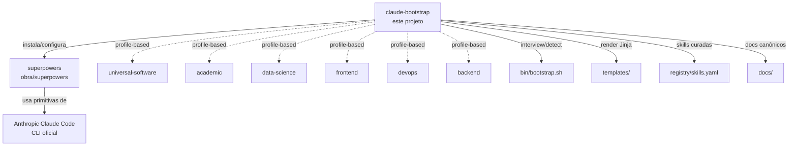
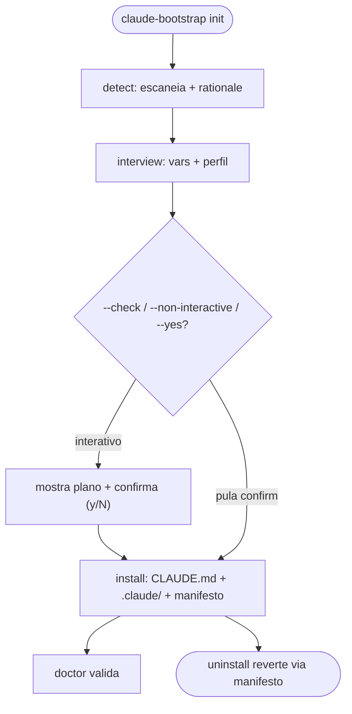

# Overview — `claude-bootstrap`

> Visão geral do projeto. Para padrão oficial Anthropic, ver [`01-canonical-anthropic.md`](01-canonical-anthropic.md). Para estado da arte da comunidade, ver [`02-state-of-the-art.md`](02-state-of-the-art.md).
>
> 🇬🇧 [English version](../00-overview.md) — the canonical copy.

---

## 1. O que é

`claude-bootstrap` é um **framework universal de bootstrap para projetos Claude Code**. Posicionamento explícito: **camada acima de [`superpowers`](https://github.com/obra/superpowers)** (~270k stars, medido em 2026-08-10; lingua franca cross-tool). Não compete; declara dependência. Híbrido entre:

- **Doc humano-legível** (`docs/`) explicando o porquê de cada escolha com URLs fonte
- **Engine Python idempotente** (o pacote `claude_bootstrap/`, com `bin/bootstrap.sh` como wrapper shell fino) que automatiza o como

**Status atual**: `v1.0.0` — primeiro release público (2026-08-11). Engine completo, 6 profiles populados (+ multi-profile para monorepos), marketplace de plugins e suíte verde no CI (a contagem viva fica no badge da README). O processo de release segue documentado em [`RELEASE.md`](../../RELEASE.md).

---

## 2. Por que existe — os 5 gaps que motivaram

Operador típico de Claude Code acumula múltiplos padrões coabitando no laptop. O censo que originou o projeto (mai/2026) encontrou quatro zonas independentes, nenhuma delas portável:

| Zona | Caminho típico | Natureza |
|---|---|---|
| Brain global | `~/.claude/` | superpowers + symlinks framework |
| Stack agêntico portátil | `~/.agent/` | memória episódica/semântica + dream cycle |
| Workspace de domínio | um projeto específico | `.claude/{commands,rules,skills}/` locais àquele projeto |
| Biblioteca bruta | um repo de coleta | centenas de subpastas de skills sem curadoria |

Nenhuma é portável + opinativa + atualizada com estado da arte mai/2026. **Cinco gaps**:

1. **Skills domínio-específicas presas** ao projeto onde nasceram, sem caminho de reuso
2. **Sem reconciliação** stack agêntico (`~/.agent/`) × `superpowers` (`~/.claude/`) — primazia ambígua
3. **Sem bootstrap adaptativo** a tipo de projeto (acadêmico, frontend, data-science, devops, backend)
4. **Bibliotecas brutas sem curadoria** por tier — centenas de skills sem critério de confiança
5. **Sem doc canônico de referência** (Anthropic + estado da arte) congelado em mai/2026

---

## 3. Arquitetura — 3 camadas

`claude-bootstrap` cuida de: **wizard de interview/detection**, **profiles** (universal/academic/...), **registry de skills curadas por tier**, **doc set canônico Anthropic + estado da arte**.

`superpowers` cuida de: **skills modulares**, **commands**, **methodology**.

Anthropic Claude Code cuida de: **CLAUDE.md, skills, agents, hooks, MCP, plugins, settings hierarchy**.

---

## 4. Fluxo do `claude-bootstrap init`

Por padrão, `init` imprime *por que* escolheu o perfil (rationale a partir dos
sinais do `detect`) e pede confirmação `[y/N]` antes de escrever (pulado por
`--check`/`--non-interactive`/`--yes`). O write grava um manifesto que o
`uninstall` usa para reverter com segurança, preservando arquivos editados.
Fluxo detalhado em [`06-bootstrap-flow.md`](06-bootstrap-flow.md) §2.

### Heurísticas do `detect.py`

| Sinal | Inferência |
|---|---|
| `package.json` + `tsconfig.json` | profile `frontend` |
| `package.json` sozinho, ou `Cargo.toml` | profile `universal-software` (o fallback — não existe profile `node` nem `rust`) |
| `pyproject.toml` / `requirements.txt` / `setup.py` | profile `data-science` se houver keyword DS (`pandas`, `torch`, …); caso contrário `universal-software` |
| `*.tf`, `Chart.yaml` de Helm, ou um `Dockerfile` mais um diretório de IaC | profile `devops` |
| `*.tex`; ou `*.bib`/`*.csl` sem projeto de código | profile `academic` |
| `.claude/` já existe | modo update, preserva customizações |
| `~/.agent/` referenciado | habilita interop com agentic-stack |
| `superpowers` em `~/.claude/skills/` | dependência satisfeita |

Só o `backend` fica de fora desse resumo, porque ele depende de um marker de
web-framework em vez de assinatura de arquivo. A tabela autoritativa — ordem de
prioridade completa, confianças e a união de monorepo — é a do
[`05-profiles.md`](05-profiles.md) §3 e §10; esta aqui é resumo e deliberadamente
não repete os números.

---

## 5. Princípios não-negociáveis

1. **Idempotente** — re-rodar `bootstrap.sh init` em projeto configurado não quebra nada
2. **Detectivo antes de prescritivo** — `detect.py` escaneia antes de `interview.py` perguntar
3. **Profile-based, não monolítico** — adicionar profile novo é zero-touch nos profiles existentes
4. **Documenta o porquê** — `docs/` cita fontes com URL
5. **Compatível com superpowers** — declara dependência, não duplica primitivas
6. **Zero alucinação em refs** — toda recomendação tem URL fonte validável
7. **CLAUDE.md ≤ 60 linhas quando possível (~140-150 máx)** — se passar, quebrar em `.claude/rules/<scope>*.md` (path-scoped, padrão Anthropic Q2/2026)

---

## 6. Roadmap das 8 fases

| # | Fase | Descrição | Status |
|---|---|---|---|
| 0 | Decisões finais | Sessão de kickoff socrática | ✅ Done (2026-05-05) |
| 1 | Esqueleto + docs canônicos | `docs/00–02`, estrutura do repo | ✅ Done (2026-05-05) |
| 2 | Templates Jinja `_base/` | `CLAUDE.md.j2`, `PROJECT-STATE.md.j2`, `settings.json`, `.gitignore` | ✅ Done |
| 3 | Bootstrap engine | `claude_bootstrap/{cli,interview,detect,install,uninstall,doctor,skill}.py` (+ `bin/bootstrap.sh` wrapper) | ✅ Done |
| 4 | Profiles | 6 populados: `universal-software`, `academic`, `frontend`, `data-science`, `devops`, `backend` | ✅ Done |
| 5 | Registry + superpowers | `registry/skills.yaml` (13 skills) + `claude-bootstrap skill` | ✅ Done |
| 6 | Validação end-to-end | auditorias de profile + wheel/init E2E | ✅ Done |
| 7 | Profiles populados + docs | 30 skills bundled em 6 profiles (25 curadas de terceiros + 5 first-party) + `docs/00–08` | ✅ Done |
| 8 | Hardening | `tests/` (pytest suite), GitHub Actions CI, pre-commit, marketplace, weekly `skill-drift.yml` | ✅ Done |

> [!NOTE]
> Este roadmap de 8 fases (kickoff) está **concluído**. O trabalho seguinte — currency
> de schemas, provenance pinada, i18n e o gate de publicação — é rastreado no
> [`CHANGELOG.md`](../../CHANGELOG.md) e no [`RELEASE.md`](../../RELEASE.md).

---

## 7. Estrutura do repo

- `README.md`, `README.pt-br.md`, `AGENTS.md`, `CLAUDE.md`, `LICENSE`, `CHANGELOG.md`
- `pyproject.toml` — packaging + config de pytest/ruff
- `.claude-plugin/marketplace.json` — o marketplace de plugins
- `claude_bootstrap/` — o pacote Python (o engine)
  - `cli.py` — dispatcher: `init|update|uninstall|detect|doctor|skill`
  - `interview.py`, `detect.py`, `install.py`, `uninstall.py`, `doctor.py`, `skill.py`, `audit.py`
  - `registry/skills.yaml` — o registry de 13 skills
  - `templates/_base/` — `CLAUDE.md.j2`, `PROJECT-STATE.md.j2`, `.claude/`, `.gitignore`
  - `templates/profiles/<name>/` — um diretório por profile, cada um com `profile.yaml`, `skills/`, `NOTICE.md`, `.claude-plugin/plugin.json`
- `bin/bootstrap.sh` — wrapper shell fino sobre o pacote
- `docs/` — este conjunto, `00–08`, em inglês; `docs/pt-br/` espelha em português
- `tests/` — suíte pytest (`test_{cli,install,uninstall,detect,doctor,skill,interview,…}`; a contagem viva fica no badge da README)
- `scripts/` — `pii-scan.py`, `verify-skill-provenance.py`, `verify-wheel-tracked.py`, `validate-refs.sh`, …
- `.github/workflows/` — `ci.yml`, `release.yml`, `skill-drift.yml`, `demo.yml`

---

## 8. Princípios herdados do rigor acadêmico

O projeto nasceu num contexto de escrita acadêmica, e herdou dele os padrões que viraram default:

- **Zero alucinação em referências** — toda recomendação cita URL validável
- **Estilo opinativo** — o inglês é o idioma canônico deste conjunto de docs, com a tradução em português espelhada em `docs/pt-br/`; identifiers, comandos e tipos ficam em inglês nas duas
- **Output Typora-friendly** GFM (pipe tables, callouts, mermaid; sem ASCII art)
- **Permissões Bash restritas** por padrão — as settings do `_base` liberam ferramentas de leitura (`ls`, `cat`, `grep`, `rg`, `find`, `wc`, `head`, `tail`, `stat`, `file`, `diff`, `tree`, `jq`) e git read-only (`status`, `diff`, `log`, `show`), nada que mute estado
- **Plan mode default** quando 3+ passos
