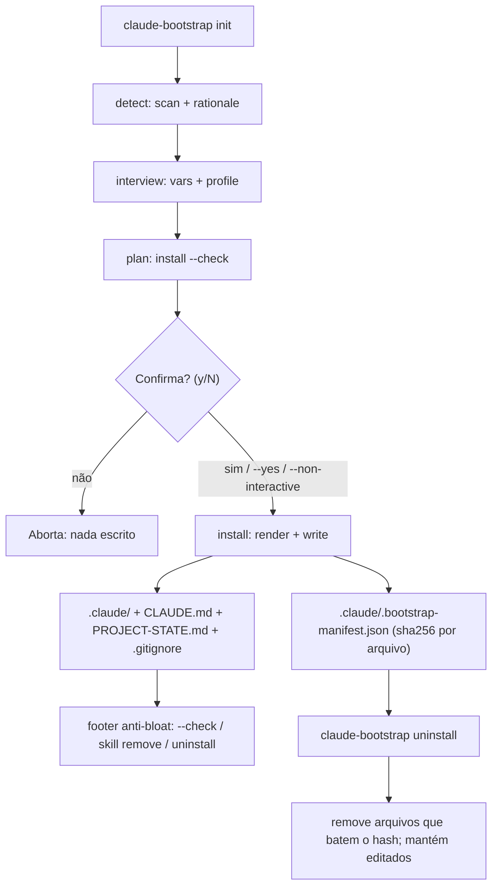

# Sistema de profiles — `claude-bootstrap`

> Profile = bundle opinativo de skills + rules + settings overrides para um tipo de projeto. Adicionar um profile novo é zero-touch nos demais (princípio profile-based, não monolítico). Toda afirmação sobre comportamento do engine abaixo foi medida contra o código deste repo em 2026-07-30.
>
> 🇬🇧 [English version](../05-profiles.md) — the canonical copy.

---

## 1. Schema `profile.yaml`

Cada profile reside em `templates/profiles/<name>/profile.yaml`. Campos reconhecidos:

| Campo | Tipo | Obrigatório | Descrição |
|---|---|---|---|
| `name` | string | sim | Identificador do profile (igual ao nome do diretório) |
| `description` | string | sim | Texto livre para exibição no interview |
| `version` | string | sim | SemVer do profile (ex.: `1.0.0`) |
| `language` | string | não | Idioma principal (`en`, `pt-br`, …) |
| `skills` | lista | não | Nomes das skills bundled — subdiretórios de `skills/` |
| `rules` | lista | não | Arquivos de rule bundled — arquivos em `rules/` |
| `agents` | lista | não | Arquivos de subagent bundled — arquivos em `agents/` |
| `output_styles` | lista | não | Arquivos de output style bundled — arquivos em `output-styles/` (repare no hífen do diretório e no underscore do campo) |
| `settings_overrides` | objeto | não | Permissões e variáveis de env adicionais (ver §5) |
| `based_on` | string | não | **Marcador declarativo de linhagem, só isso. Nenhum código e nenhum teste lê o campo** — ver §8 antes de usar |

Exemplo mínimo (profile `universal-software`, o default):

```yaml
name: universal-software
description: >
  Default general-purpose profile for Claude Code projects. Bundles first-party skills
  authored in this repository (see NOTICE.md), complements rather than replaces
  superpowers (declared dependency), and lets the user/project add path-scoped rules
  in .claude/rules/ as needed.
version: 1.0.0
language: en
skills:
  - newproj
  - ponytail
  - recover
  - refactor
  - vetting-agent-skills
rules: []
settings_overrides: {}
```

Exemplo mais completo (profile `academic`), com rules, output style e overrides de permissão:

```yaml
name: academic
description: >
  Profile for academic / scientific writing projects (papers, theses, posters,
  bibliographies, peer-review prep).
version: 1.0.0
language: en
skills:
  - citation-management
  - exploratory-data-analysis
  - exa-search
rules:
  - latex.md
output_styles:
  - concise-academic.md
settings_overrides:
  permissions:
    allow:
      - "Bash(pandoc *)"
      - "Bash(latexmk *)"
```

---

## 2. Profile lifecycle: detect -> confirm -> install -> uninstall

Todo o ciclo é exposto pela CLI `claude-bootstrap` (que orquestra os módulos
`detect` / `interview` / `install` / `uninstall` em `claude_bootstrap/`).



Pontos do ciclo (todos verificáveis em `claude_bootstrap/cli.py`):

- **Rationale de detecção (A6)**: `init` imprime *por que* escolheu o profile
  (os sinais do `detect`), não um JSON cru.
- **Confirm-before-write (A4)**: por padrão `init`/`update` mostram o plano
  (`install --check`) e pedem `[y/N]` antes de escrever. Pulado por `--check`,
  `--non-interactive` (CI) e `--yes`.
- **Manifesto (A5)**: cada write grava `.claude/.bootstrap-manifest.json`
  (sha256 por arquivo + linhas geridas do `.gitignore`), determinístico.
- **Uninstall (A5)**: `claude-bootstrap uninstall` lê o manifesto, remove só os
  arquivos cujo hash ainda bate, **mantém os editados** e reverte o `.gitignore`.

O fluxo completo está detalhado em `06-bootstrap-flow.md`.

---

## 3. Profile selection: interview / detect

### Interview interativo

`claude_bootstrap/interview.py` lista os profiles ativos em `templates/profiles/` e exibe a sugestão do `detect` como padrão pré-selecionado. O operador confirma ou escolhe outro. Em `--non-interactive` usa defaults sem prompts.

### Heurísticas de detect (`claude_bootstrap/detect.py`)

Prioridade top-down — primeira regra que satisfaz é retornada (`infer_profile()`):

| Prioridade | Sinal detectado | Profile sugerido | Confiança |
|---|---|---|---|
| 1 | Qualquer `*.tex`; ou `*.bib` sem projeto de código; ou `*.csl` fora de um projeto de software | `academic` | 0.95 |
| 2 | `Cargo.toml` | `universal-software` (fallback rust) | 0.60 |
| 3 | `pyproject.toml` / `requirements.txt` / `setup.py` + keyword data-science (`pandas`, `torch`, `tensorflow`, `scikit-learn`, `jupyter`, `numpy`) | `data-science` | 0.85 |
| 4 | `pyproject.toml` / `requirements.txt` / `setup.py` sem keyword DS | `universal-software` | 0.70 |
| 5 | `package.json` + `tsconfig.json` | `frontend` | 0.85 |
| 6 | `package.json` sem `tsconfig.json` | `universal-software` | 0.70 |
| 7 | Qualquer `*.tf` ou `Chart.yaml` de Helm (recursivo); ou um `Dockerfile` mais um diretório casando `terraform`/`ansible`/`kubernetes`/`k8s*`/`helm`/`charts`/`manifests`/`deploy(ment)s` | `devops` | 0.80 |
| 8 | Nenhum sinal | `null` | 0.00 |

Duas assimetrias que valem conhecer, ambas deliberadas. `.tex` sozinho basta para `academic`, mas um `.bib` ou `.csl` isolado não: bibliotecas científicas em Python costumam trazer um `paper.bib`, e pipelines de documentação vendoram um `.csl` ao lado de código de verdade — então esses dois só contam quando não há projeto de código para sequestrar. E `devops` é checado **por último** apesar de ser o sinal estrutural mais forte, porque um repo que tem stack de linguagem *e* IaC é melhor servido pelo profile da linguagem.

O resultado JSON do `detect` inclui também `signals` (lista legível usada no rationale do `init`), `mode` (`init` vs `update`), `superpowers_available` e `agentic_stack_interop` — campos informativos para o interview, não para seleção de profile. Em monorepo ele carrega ainda `profiles` e `stack_paths`; ver §10.

---

## 4. Profile install: `install_profile_assets()`

Função `install_profile_assets()` em `claude_bootstrap/install.py`. Fluxo:

1. Carrega `profile.yaml` via `load_profile()`.
2. Para cada item em `skills[]`:
   - Fonte: `templates/profiles/<name>/skills/<skill_name>/`
   - Destino: `<target>/.claude/skills/<skill_name>/`
   - Copia todos os arquivos recursivamente com semântica **create-only**.
3. Para cada item em `rules[]`, `agents[]` e `output_styles[]`:
   - Fonte: `templates/profiles/<name>/{rules,agents,output-styles}/<arquivo>`
   - Destino: `<target>/.claude/{rules,agents,output-styles}/<arquivo>`
   - Copia com semântica **create-only**. Arquivo declarado que não existe em
     disco é reportado como `source-missing`, não derruba a execução.
4. Se o profile tem `subdir-examples/<subdir>-CLAUDE.md`, instala em
   `<target>/<subdir>/CLAUDE.md` (mecanismo de CLAUDE.md por subdiretório).
   Esses exemplos estáticos são **suprimidos em modo multi-profile** — §10 explica por quê.

Além dos assets de profile, o `install.main()` renderiza `CLAUDE.md`,
`PROJECT-STATE.md`, `.claude/settings.json` (com `settings_overrides` aplicados —
ver §5) e faz soft-merge do `.gitignore`. Ao final de um write real, grava o
**manifesto** `.claude/.bootstrap-manifest.json` (sha256 por arquivo emitido +
linhas geridas do `.gitignore`) usado pelo `uninstall`.

**Idempotência**: a semântica create-only (em `install_create_only()`) garante que re-execuções sem `--force` nunca sobrescrevam edições do usuário. O status por arquivo pode ser `created`, `exists-skipped`, `overwritten`, `unchanged`, `diverged (.new)` (modo `--update`), ou os equivalentes `would-*` no modo `--check`. O manifesto é determinístico, então re-rodar com as mesmas vars o reporta como `unchanged`.

**`--force`**: sobrescreve arquivos existentes. Use com cuidado — apaga customizações locais.

**`--check`**: dry-run completo. Reporta o que seria feito sem escrever nada (e sem gravar manifesto).

**`--update`**: para arquivos divergidos, escreve `<path>.new` em vez de pular. O
`.new` entra no manifesto com hash próprio, então o `uninstall` também o remove —
desde que continue intocado. Um `.new` editado pelo usuário falha a checagem de
hash e é mantido, como qualquer outro arquivo editado.

A saída do install é JSON com a lista de `actions` (`file`, `status`), facilitando auditoria e CI.

---

## 5. `settings_overrides`

O campo `settings_overrides` em `profile.yaml` descreve duas sublistas:

```yaml
settings_overrides:
  permissions:
    allow:
      - "Bash(pandoc *)"   # permissão extra mergeada em settings.json
    deny:
      - "Bash(terraform destroy *)"  # devops nega operações destrutivas
  env:
    MINHA_VAR: "valor"     # variável injetada em .claude/settings.json (env)
```

**Implementado** (`merge_settings_overrides()` em `install.py`, exercido por
`test_settings_overrides_merged_for_*`). O merge é profundo, com regras por tipo:

- **dict + dict**: recursão (chaves do profile estendem/sobrescrevem as do base).
- **list + list**: concatena base + profile e **dedupe preservando ordem** (ex.: `permissions.allow`).
- **escalar**: profile vence.

O resultado é gravado em `<target>/.claude/settings.json`. Profiles como `devops`
usam isso para liberar `terraform plan`/`kubectl get` no `allow` e negar
`terraform destroy`/`kubectl delete` no `deny`; `universal-software` tem
`settings_overrides: {}` (env fica vazio).

Para referência do schema de permissões, ver `01-canonical-anthropic.md` §2 (Skills standard) e `04-skills-curated.md` (skills com permissões documentadas).

---

## 6. Profiles disponíveis (v1.0.0)

| Profile | Skills bundled | Upstream das skills | Status |
|---|---|---|---|
| `universal-software` | 5 | — first-party (escritas neste repo, MIT) | ✅ default |
| `academic` | 3 | 3 `K-Dense-AI/scientific-agent-skills` (MIT) | ✅ ready |
| `data-science` | 6 | 6 `alirezarezvani/claude-skills` (MIT) | ✅ ready |
| `frontend` | 7 | 3 `anthropics/skills` (Apache-2.0) + 4 `alirezarezvani/claude-skills` (MIT) | ✅ ready |
| `devops` | 5 | 5 `alirezarezvani/claude-skills` (MIT) | ✅ ready |
| `backend` | 4 | 4 `alirezarezvani/claude-skills` (MIT) | ✅ ready |

Todo profile que embarca skills tem um `NOTICE.md` com proveniência por skill,
licença e — para conteúdo de terceiro — o commit upstream pinado. O bundle é
content-verified por `scripts/verify-skill-provenance.py`: **30 skills, 0 DIFFERS**,
divididas em 17 EXACT + 8 WS-ONLY (diferença só de whitespace) + 5 FIRST-PARTY.

Leia esses três veredictos como forças de evidência diferentes, não como um só. EXACT
e WS-ONLY são comparação byte a byte contra um commit upstream específico. FIRST-PARTY
só afirma que o `SKILL.md` existe, porque skill escrita aqui não tem upstream contra o
que comparar — inerente à classe, não lacuna da ferramenta.

Commit pinado é ponto fixo, então upstream anda para além dele; é exatamente para isso
que o pin serve. O `verify-skill-provenance.py --check-currency` reporta quais pins
ficaram para trás do `HEAD` upstream, e o `.github/workflows/skill-drift.yml` roda a
checagem semanalmente. Veredicto `STALE` ali significa "o upstream avançou", nunca "o
conteúdo bundled mudou" — conteúdo bundled é o que a comparação byte a byte acima cobre.

O profile `backend` é **config-only**: detecta o stack e emite guidance, permissões,
skills e rules, mas **nunca instala dependências**. A garantia real é tool-side, não
advisory — o `install.py` não shella nenhum package manager.

De-bundled até aqui: `xlsx`, `senior-devops` e `theme-factory` (2026-06-06, conteúdo
fora do domínio); `release-manager` (2026-06-29, removido do `HEAD` upstream, então não
dá mais para provenance-verificar); e `doc-coauthoring`, `pdf`, `pptx`, `docx`
(2026-07-26, **sem licença que permita redistribuição** — ver
`templates/profiles/academic/NOTICE.md`).

---

## 7. Como adicionar um profile novo

```
1. mkdir templates/profiles/<name>/
2. Criar profile.yaml mínimo (name, description, version obrigatórios)
3. Opcional: adicionar skills/  (subdiretórios com SKILL.md) + NOTICE.md de proveniência
4. Opcional: adicionar rules/, agents/, output-styles/ e subdir-examples/<subdir>-CLAUDE.md
5. Registrar heurística em claude_bootstrap/detect.py (função infer_profile)
6. Registrar no interview em claude_bootstrap/interview.py (lista PROFILES)
7. Testar: claude-bootstrap init --target /tmp/fixture --profile <name> --check
```

Verificação rápida da heurística:

```bash
claude-bootstrap detect /tmp/fixture
```

A saída JSON deve mostrar `"profile_suggestion": "<name>"` com a confiança esperada. O profile também deve aparecer no interview interativo. Adicione um teste `test_init_with_<name>_profile` espelhando os existentes em `tests/test_install.py`.

---

## 8. Composição — `_base/`, não `based_on`

> [!IMPORTANT]
> **Esta seção afirmava o contrário até 2026-07-30.** Ela abria com "o campo `based_on`
> declara herança entre profiles" e descrevia a herança de assets como feature planejada.
> Medido contra o código deste repo: `based_on` não é lido por **nenhum código e nenhum
> teste** — `git grep based_on -- claude_bootstrap/ tests/ scripts/` devolve apenas os cinco
> `profile.yaml` que declaram o campo. Ele é inerte. Se você chegou aqui por uma cópia em
> cache do texto antigo, esta versão é a correta. A mesma correção entrou no
> `03-anti-patterns.md` item 10.

Composição existe de verdade, e vem do `_base/`.

O `install.py` resolve `<templates_dir>/_base` (`install.py:525`) e o aplica para **todo**
profile; o profile então se sobrepõe. Não há merge entre profiles irmãos:
`profile.get("skills")` é lido direto do arquivo do próprio profile. Ou seja, a regra que
vale é: o que for universal mora no `_base/`, e o profile declara só o seu delta. É
exatamente isso que torna adicionar um profile zero-touch nos demais — nada faz merge
entre irmãos, então nada quebra entre irmãos.

`settings_overrides` (§5) também é um merge real, mas contra as settings base renderizadas
— não contra um profile pai nomeado por `based_on`.

**O que fazer com o `based_on`:** cinco profiles declaram `based_on: universal-software`, e
como documentação de intenção o campo é preciso — registra linhagem para um leitor humano.
Trate-o como exatamente isso, e nunca escreva um profile cujos assets dependam dele
resolver. Se um profile precisa do conteúdo de outro hoje, copie explicitamente os assets
necessários para o diretório do profile novo.

---

## 9. Anti-patterns de profile

- **Repetir configuração universal em todo profile**: se cada profile especializado reescreve o baseline comum, uma mudança universal vira N edições e as cópias divergem. Coloque o universal no `_base/` e deixe o profile carregar só o delta. (É o item 10 do `03-anti-patterns.md`, visto pelo lado dos profiles.)
- **Escrever profile que depende do `based_on` resolver**: o campo é inerte (§8). Um profile que omite skills ou permissões esperando herdá-las de `universal-software` instala incompleto, sem erro nenhum.
- **Hardcoded paths absolutos em skills**: skills devem usar caminhos relativos ou variáveis de contexto. Paths como `/home/user/projeto/` quebram em qualquer outra máquina.
- **Profile monolítico com dezenas de skills não relacionadas**: viola o princípio de separação por domínio. Prefira profiles focados e compartilhe o piso comum pelo `_base/`.
- **Embarcar cópia de skill que o superpowers já provê globalmente**: duplicar cria divergência silenciosa entre as duas cópias. O `universal-software` embarca deliberadamente só skills escritas aqui — cinco delas, nenhuma existente no superpowers upstream.
- **Modificar `_base/` para comportamento de profile específico**: o diretório `_base/` é compartilhado por todos os profiles, então uma mudança ali alcança todos. Customizações de domínio pertencem em `templates/profiles/<name>/`.
- **Testar profile apenas com `--check`**: `--check` valida o que seria feito, mas não executa. Sempre testar com `--target /tmp/fixture` real antes de propor um profile como ready.

Para anti-patterns gerais de skills e rules, ver `03-anti-patterns.md`.

---

## 10. Multi-profile: monorepos (Model A — union + per-subdir)

Um repo single-stack recebe **um** profile. Um **monorepo** com vários stacks em sub-projetos
(ex.: `frontend/` React + `backend/` FastAPI + `infra/` terraform) recebe a **união** dos code
stacks detectados.

**Descoberta (detect).** `infer_profiles()` enumera sub-projetos de forma limitada e
convenção-dirigida — raiz + filhos imediatos + um nível sob `apps|packages|services|libs/*` + globs
de workspace (`package.json#workspaces`, `pnpm-workspace.yaml`) — com prune-list (`node_modules`,
`examples`, `fixtures`, `template`, …). Cada dir vira um profile via `detect_stack(dir)`; o resultado
é `profiles: sorted(set)` + `stack_paths: {profile: [dir-concreto, …]}`. `detect.json` mantém
`profile_suggestion = profiles[0]` (back-compat).

**Regras de membership.** Code stacks: `frontend`, `data-science`, `devops`, `backend`. `academic`
é **exclusivo** (domínio de repo inteiro — retornado sozinho, sem descoberta). `universal-software`
e os fallbacks rust/node **nunca** entram numa união (só quando nenhum code stack positivo casa).
Backend só dispara com um **marker de web-framework** (FastAPI/Flask/Django/Express/NestJS/Rails/
Spring/…); um backend genuinamente **frameworkless** fica `universal-software` (limitação documentada).
Tie-break backend↔data-science: sinais ML fortes (`torch`/`tensorflow`) → data-science mesmo com
framework; `numpy`/`pandas` + framework → backend.

**Emissão (Model A + per-subdir — AMBOS).**
- **Root union** (`.claude/`): permissões unidas (merge com iteração sorted → byte-estável), **todos**
  os skills dos profiles (com detecção de colisão same-name/diff-content — não silenciosa), e um
  `rules/<stack>.md` por profile com `paths:` derivado dos dirs concretos de `stack_paths` (`<dir>/**`).
- **Per-subdir**: um `<dir>/CLAUDE.md` fino por sub-projeto descoberto, cavalgando o carregamento
  nativo on-demand de subtree (carrega quando o Claude trabalha em arquivos daquele dir — não no
  `cd`). O root é sempre filtrado (nunca sobrescreve o CLAUDE.md union). Em modo multi o
  `subdir-examples` estático (nomes fixos) é **suprimido**.
- **Settings e skills ficam só no root** — `settings.json` não cascateia por subdir (confirmado nos
  docs oficiais); só o `CLAUDE.md` per-subdir é dir-scoped.

**Caveat (`paths:` rules).** Bug upstream conhecido (#23478): path-scoped rules disparam no Read, não
no Write/create. O `CLAUDE.md` per-subdir compartilha a **mesma** classe de trigger (carrega ao ler
um arquivo no subtree), então ambos são best-effort — a camada per-subdir vale pela orientação
dir-scoped + limpeza estrutural, sem edge de confiabilidade verificado sobre as rules.

**Byte-identidade single-profile.** Tudo acima é aditivo: um repo single-stack emite exatamente como
antes (footer `profile:` singular, sem per-subdir dinâmico, rules extension-scoped, manifest com
`profile` scalar). O manifest multi ganha `profiles: [...]` (o scalar `profile` fica para readers
legados); `audit`/`uninstall`/`doctor` leem ambos.

*Cross-references:* `01-canonical-anthropic.md` §2 (Skills standard) — `03-anti-patterns.md` — `04-skills-curated.md` (registry) — `06-bootstrap-flow.md` (fluxo completo de bootstrap) — `07-glossary.md`
