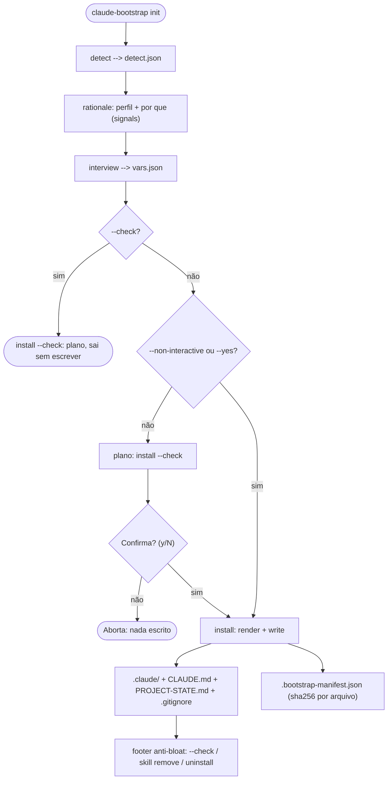
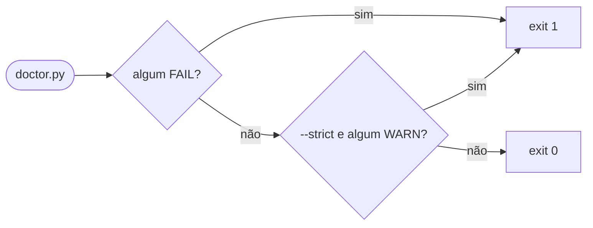
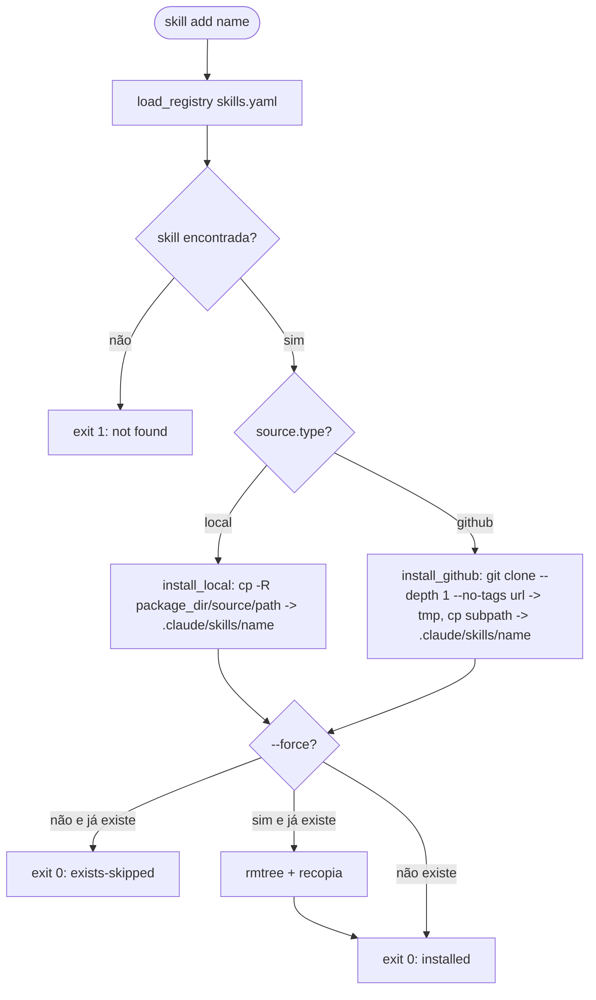

# Fluxo do engine — `claude-bootstrap`

> Detalhamento operacional de cada subcomando. O engine é o pacote `claude_bootstrap/`;
> `bin/bootstrap.sh` é um wrapper fino que resolve o runner Python e repassa. Toda afirmação abaixo
> foi medida contra o código em 2026-08-03.
>
> 🇬🇧 [English version](../06-bootstrap-flow.md) — the canonical copy.

---

## 1. Entry point: `bin/bootstrap.sh`

O dispatcher é um script Bash com `set -euo pipefail`. Nenhuma lógica de negócio vive ali — ele
roteia argumentos e resolve o runner.

### `pick_python_runner`

Antes de qualquer subcomando que precisa de Jinja2/PyYAML, o dispatcher chama `pick_python_runner`:

1. Testa `python3 -c "import jinja2, yaml"` — se funcionar, retorna `python3`.
2. Senão, se `uv` estiver disponível, retorna `uv run --with jinja2 --with pyyaml --no-project python3`.
3. Senão, aborta com exit code 3 e instrução de instalação.

> [!NOTE]
> `detect.py` e `doctor.py` são sempre chamados com `python3` puro — sem dependências opcionais.
> `install.py` e `skill.py` passam pelo runner para garantir Jinja2/PyYAML mesmo num ambiente onde
> nada foi instalado com `pip` antes.

### Subcomandos disponíveis

Despachados por `claude_bootstrap/cli.py`:

| Subcomando | Implementado | Módulo alvo |
|---|---|---|
| `init` | Sim | `detect` + `interview` + `install` (com confirm gate + manifesto) |
| `update` | Sim | `install --update` (arquivos divergidos -> `<path>.new`) |
| `uninstall` | Sim | `uninstall` (reverte um emit via o manifesto) |
| `detect` | Sim | `detect` |
| `doctor` | Sim | `doctor` |
| `audit` | Sim | `audit` — relatório de proveniência + integridade de um `.claude/` emitido |
| `skill` | Sim | `skill` (list\|show\|add\|remove\|update\|validate) |
| `help` / `-h` / `--help` | Sim | inline |
| `version` / `-V` / `--version` | Sim | inline |

O `audit` é o que um usuário regulado ou de E-E-A-T anexa a um dossiê de compliance: exatamente o
que foi emitido, de onde veio cada skill (`repo@SHA` upstream) e o hash de integridade reconciliado
contra o manifesto de install. É **offline** — não faz chamada de rede, então o relatório é uma
*asserção* que um terceiro re-verifica de forma independente com
`scripts/verify-skill-provenance.py`. Quando o arquivo de pins não pode ser resolvido (um layout
instalado por pip, onde `scripts/` não é adjacente), o SHA sai como `null` e a skill como
`unpinned`: auditoria tem que dizer "desconhecido", nunca um SHA obsoleto com cara de certeza.

---

## 2. Subcomando `init`

Orquestra três etapas em sequência, usando um `tmpdir` como canal de dados entre elas.

### Flags

| Flag | Tipo | Default | Efeito |
|---|---|---|---|
| `--profile <name>` | string, **repetível** | auto-detect | Pula a pergunta de perfil. Passada mais de uma vez, o emit é a **união** desses profiles — o caso monorepo multi-profile |
| `--target <path>` | string | `.` | Projeto alvo |
| `--non-interactive` | bool | false | Usa defaults, sem prompts (também pula o confirm gate) |
| `--yes` / `-y` | bool | false | Pula o confirm-before-write, mantém o interview |
| `--force` | bool | false | Sobrescreve arquivos existentes |
| `--check` | bool | false | Dry-run — reporta o plano sem escrever (não grava manifesto) |
| `--tier <lax\|strict>` | choice | `lax` | Tier de permissão do `settings.json` emitido |
| `--sandbox` | bool | false | Emite o bloco opt-in de sandbox |
| `--hooks` | bool | false | Emite o bundle opt-in conservador de hooks (PreToolUse warn + skill-dispatch) |
| `--fallback-model` | bool | false | Emite o `fallbackModel` opt-in (resiliência de modelo) |

> [!WARNING]
> `--tier` significa duas coisas diferentes em dois subcomandos. Aqui é o tier de permissão
> (`lax`/`strict`); em `skill list --tier` é o tier do registry (`1`/`2`/`3`). Mesma palavra, eixos
> sem relação.

### Diagrama de fluxo `init`



O `claude_bootstrap/cli.py` orquestra `detect` -> `interview` -> `install` via um `tmpdir`. O
`detect` é renderizado como **rationale** legível, há um **confirm-before-write** `[y/N]` por
padrão (pulado por `--check` / `--non-interactive` / `--yes`), e o write grava o **manifesto** que o
`uninstall` consome.

**Variáveis produzidas por `interview.py`** (escritas em `vars.json`):

```
project_name, project_description, primary_language, is_monorepo,
git_remote, profile_name, superpowers_available, agentic_stack_interop,
extra_rules, generated_at, bootstrap_version,
tier, sandbox, hooks, fallback_model
```

`is_monorepo` não é perguntado no modo não-interativo — é derivado de ter vindo mais de um
`--profile`.

---

## 3. Subcomando `detect`

Chamada direta: `bootstrap.sh detect [path] [--output FILE] [--quiet]`

`detect.py` é **read-only** — não escreve nada no projeto alvo.

### Heurísticas de `infer_profile` (em ordem de prioridade)

Existem dois entry points e eles não são intercambiáveis: `infer_profile` pontua **um** diretório, e
`infer_profiles` percorre um monorepo e devolve a união entre os subdiretórios. `academic` é
exclusivo — volta sozinho, nunca unido a um stack de código.

| # | Sinal detectado | Perfil sugerido | Confiança |
|---|---|---|---|
| 1 | `*.tex` (sozinho já basta), ou `*.csl` / `*.bib` sem projeto de código | `academic` | 0.95 |
| 2 | `Cargo.toml` | `universal-software` | 0.60 |
| 3 | `pyproject.toml` / `requirements.txt` / `setup.py` + deps de data science | `data-science` | 0.85 |
| 4 | `pyproject.toml` / `requirements.txt` / `setup.py` (sem data science) | `universal-software` | 0.70 |
| 5 | `package.json` + `tsconfig.json` | `frontend` | 0.85 |
| 6 | `package.json` (sem `tsconfig.json`) | `universal-software` | 0.70 |
| 7 | `*.tf` **ou** `Chart.yaml` (ambos buscados recursivamente), **ou** um Dockerfile mais um diretório de IaC/manifests | `devops` | 0.80 |
| — | Nenhum sinal | `null` | 0.00 |

Keywords de data science (procuradas dentro dos arquivos de dependência):
`pandas`, `torch`, `tensorflow`, `scikit-learn`, `jupyter`, `numpy`.

Dois guards que vale conhecer, porque cada um codifica um falso positivo real:

- **`.csl` sozinho não faz um projeto ser acadêmico.** Um arquivo de estilo de citação também é
  asset de pandoc/Quarto/R-Markdown, então o sinal é condicionado a não haver projeto de código.
- **`paper.bib` continua acadêmico de propósito.** É a forma padrão de submissão ao JOSS.

`.github/workflows/` não participa da checagem de `devops` — um diretório de CI não diz nada sobre
o projeto *ser* infraestrutura.

### Campos do JSON de saída

```json
{
  "scanned_path": "/abs/path",
  "profile_suggestion": "academic",
  "profiles": ["academic"],
  "confidence": 0.95,
  "mode": "init",
  "signals": ["2 .tex file(s) found"],
  "superpowers_available": true,
  "agentic_stack_interop": true,
  "scanned_at": "2026-05-05T10:00:00"
}
```

**`mode`**: `"update"` se `.claude/` já existe no target, `"init"` caso contrário.
**`profiles`** é a lista multi-profile; `profile_suggestion` é o escalar mantido ao lado dela para
que um leitor de profile único não precise mudar.

> Para a lista de perfis disponíveis, ver [`05-profiles.md`](05-profiles.md).

### Arquivos `CLAUDE.md` de subdiretório (contexto hierárquico)

A partir de v0.4.0a0 (mantido em v1.0.0), `install.py` instala `<subdir>/CLAUDE.md` automaticamente sempre que o profile
ativo embarca um `subdir-examples/<subdir>-CLAUDE.md`:

- `templates/profiles/<profile>/subdir-examples/`
  - `src-CLAUDE.md` -> `target/src/CLAUDE.md`
  - `notebooks-CLAUDE.md` -> `target/notebooks/CLAUDE.md`
  - `infra-CLAUDE.md` -> `target/infra/CLAUDE.md`
  - `manuscript-CLAUDE.md` -> `target/manuscript/CLAUDE.md`

A convenção é o mecanismo inteiro: arquivo chamado `<subdir>-CLAUDE.md` instala como
`<subdir>/CLAUDE.md`. O filesystem walking do Claude Code (ver
[code.claude.com/docs/en/memory](https://code.claude.com/docs/en/memory)) carrega esses arquivos
**on-demand**, quando o Claude está trabalhando dentro daqueles subdiretórios — então eles não
bloatam o contexto raiz.

Todo profile embarcado tem um:

| Profile | Subdir example | Escopo |
|---|---|---|
| `universal-software` | `scripts/CLAUDE.md` | Hygiene para utility scripts |
| `frontend` | `src/CLAUDE.md` | Convenções de componentes/styling/state |
| `backend` | `app/CLAUDE.md` | Convenções da camada de serviço |
| `data-science` | `notebooks/CLAUDE.md` | Reprodutibilidade de notebooks |
| `devops` | `infra/CLAUDE.md` | Guardrails de IaC (plan-before-apply, secrets) |
| `academic` | `manuscript/CLAUDE.md` | Citação / densidade / IMRAD para manuscritos |

Todos os seis profiles embarcados têm um, então o caminho de fallback só aparece num profile que
você mesmo escreve: sem diretório `subdir-examples/`, o `install.py` emite o `CLAUDE.md` raiz mais os
assets em `.claude/` e nada além. Nada dá erro — o recurso simplesmente não existe ali.

---

## 4. Subcomando `doctor`

Chamada: `bootstrap.sh doctor [path] [--json] [--quiet] [--strict]`

Executa 13 checks read-only sobre o projeto alvo. O `run_checks` do `doctor.py` é a ordem
autoritativa.

### Checks, em ordem

| # | Nome do check | Status possível | O que verifica |
|---|---|---|---|
| 1 | `CLAUDE.md exists` | PASS / FAIL | `CLAUDE.md` na raiz ou em `.claude/` |
| 2 | `CLAUDE.md size ≤150 lines (ideal ≤60)` | PASS / WARN / FAIL | `≤150` PASS; `151-200` WARN; `>200` FAIL |
| 3 | `.claude/ directory exists` | PASS / FAIL | `.claude/` presente |
| 4 | `.claude/settings.json valid JSON` | PASS / FAIL | parse sem erro |
| 5 | `.claude/settings.json has $schema` | PASS / WARN | chave `$schema` presente |
| 6 | `.claude/settings.json has secret-deny rules` | PASS / FAIL | regex `\.env|secret|credential|key|pem` em `permissions.deny` |
| 7 | `.gitignore exists` | PASS / WARN | arquivo presente |
| 8 | `.gitignore covers CLAUDE.local.md` | PASS / WARN | linha exata `CLAUDE.local.md` |
| 9 | `.gitignore covers .env` | PASS / WARN | padrão `^\.env` |
| 10 | `PROJECT-STATE.md exists` | PASS / WARN | arquivo presente |
| 11 | `superpowers reachable` | PASS / WARN / SKIP | mencionado no `CLAUDE.md` **e** o diretório existe em `~/.claude/` |
| 12 | `profile referenced in CLAUDE.md` | PASS / WARN | regex `profile:\s*(\w[\w-]*)` |
| 13 | `path-scoped rules present` | PASS / WARN | quantos arquivos `.md` existem em `.claude/rules/` |

O check 2 tem um ramo que vale declarar, porque inverte a leitura usual da palavra: com `CLAUDE.md`
ausente ele reporta status **FAIL** e `skipped — CLAUDE.md missing` como detalhe. O detalhe diz
skipped, o status não.

### Exit codes e formatos



**Formatos de saída**:

- Padrão (plain): uma linha `[STATUS] check-name: details` por check, mais um resumo numérico.
- `--json`: objeto JSON com `path`, `checks[]`, `summary{pass,warn,fail,skip}`.
- `--quiet`: plain mostra só as linhas FAIL (a forma do JSON não muda).
- Com `rich` instalado: tabela colorida no terminal, degradando graciosamente na ausência dele.

---

## 5. Subcomando `skill`

Chamada: `bootstrap.sh skill <subcomando> [args]`

Gerencia skills no projeto alvo através de `claude_bootstrap/registry/skills.yaml`.

> [!IMPORTANT]
> Registry e bundle são coisas diferentes. O `init` instala skills a partir do `profile.yaml` do
> profile; o registry é o que o `skill add` lê. Nada em `install.py` abre o registry.
> Ver [`04-skills-curated.md`](04-skills-curated.md) §2 para a separação completa.

### Subcomandos de `skill`

| Subcomando | Status | O que faz |
|---|---|---|
| `list` | Implementado | Lista skills do registry com status `installed` / `available` |
| `show <name>` | Implementado | Imprime a entry completa do registry (JSON) |
| `add <name>` | Implementado | Copia a skill para `target/.claude/skills/<name>/` |
| `remove <name>` | Implementado | Remove `target/.claude/skills/<name>/` |
| `validate` | Implementado | Quatro checks + um aviso de staleness — ver abaixo |
| `update [--name <name>]` | Implementado | Re-extrai as skills `source.type: github` instaladas a partir das fontes atuais do registry |

O `validate` checa: campos obrigatórios presentes, **`name` sem duplicata**, `source.path` local
existe, e entry `github` carrega `url` e `path`. Também avisa quando `last_validated_at` está mais
velho que `STALE_DAYS = 90`. Ele **não** checa o range do tier — um registry declarando `tier: 9` ou
`tier: 0` valida limpo.

> [!WARNING]
> `skill update` sem `--name` sai com 1 em qualquer projeto bootstrapado. Ele percorre todo diretório
> em `<target>/.claude/skills/`, e as skills colocadas pelo `init` vêm do **bundle**, não do
> registry, então cada uma é reportada `not-in-registry` e o return code é 1. Passe `--name` para uma
> skill que você instalou de fato com `skill add`.

### Diagrama de fluxo `skill add`



Um `source.path` `local` resolve contra o **diretório do pacote instalado**, não contra o checkout —
`REPO_ROOT = Path(__file__).parent` no `skill.py`. O clone `github` roda com timeout de 60 segundos,
e o destino só é apagado **depois** que o clone dá certo.

**Flags de `skill add`**:

- `--target <path>` (default `.`) — projeto alvo
- `--force` — sobrescreve se já instalada
- `--registry <path>` — registry alternativo

**Filtros de `skill list`**:

- `--profile <name>` — filtra por perfil
- `--tier <1|2|3>` — filtra por tier do registry (sem relação com `init --tier`)
- `--json` — saída JSON com campo `_status`

---

## 6. Estado dos subcomandos

Todo subcomando despachado está **implementado** (ver §1): `init`, `update`, `uninstall`, `detect`,
`doctor`, `audit`, `skill` (`list|show|add|remove|update|validate`).

- **`update`** re-roda o install preservando customizações: arquivo divergido vira `<path>.new` em
  vez de ser sobrescrito; confirm-before-write `[y/N]` por padrão.
- **`skill update [--name <name>]`** re-extrai as skills `source.type: github` instaladas a partir
  das fontes atuais do registry. Leia o caveat no §5 antes de rodar sem `--name`.

> [!NOTE]
> Versões anteriores deste documento registravam aqui uma lacuna conhecida: *"arquivos `<path>.new`
> emitidos por `update` não entram no manifesto, então `uninstall` não os remove."* **Isso é falso
> desde o conserto.** Um arquivo `.new` é registrado com o próprio sha256, e o `uninstall` o remove
> quando ele está intocado — arquivo cujo hash não bate mais com o manifesto é mantido e reportado
> `modified-kept`, que é a mesma proteção que todo outro arquivo owned recebe.

---

## 7. Idempotência

`install.py` implementa semânticas distintas por tipo de arquivo.

### create-only

Aplica-se a `CLAUDE.md`, `PROJECT-STATE.md`, `.claude/settings.json`.

| Condição | Sem `--force` | Com `--force` | Sob `update` |
|---|---|---|---|
| Arquivo não existe | `created` | `created` | `created` |
| Arquivo existe, conteúdo igual | `unchanged` | `unchanged` | `unchanged` |
| Arquivo existe, conteúdo diferente | `exists-skipped` | `overwritten` | `diverged (.new)` |

### soft-merge (`.gitignore`)

Lê o `.gitignore` existente e adiciona apenas as linhas do template que ainda não estão presentes
(comentários são ignorados na comparação). Re-executar não produz linhas duplicadas.

| Condição | Resultado |
|---|---|
| Arquivo não existe | `created` |
| Todas as linhas já presentes | `unchanged` |
| Linhas novas a adicionar | `merged (N lines)` |

### Evidência de idempotência

`tests/test_install.py` roda `init` duas vezes no mesmo diretório e exige que a segunda passada
reporte todos os arquivos como `unchanged` — bytes idênticos entre os templates do repositório e os
arquivos já presentes.

---

## 8. Stack runtime: dependências Python

Todas as quatro são declaradas como `dependencies` obrigatórias no `pyproject.toml`. O que é
opcional é a **degradação**: duas delas têm fallback gracioso se o import falhar em runtime, duas
não.

| Lib | Papel | Onde é usada | Fallback na ausência |
|---|---|---|---|
| `jinja2` | obrigatória | `install.py`: renderiza os templates `.j2` | nenhum — erro claro mais `exit 3`, o mesmo código que o `pick_python_runner` usa |
| `pyyaml` | obrigatória | `install.py`: lê `profile.yaml`; `skill.py`: lê `skills.yaml` | nenhum — mesmo erro claro mais `exit 3`, alcançado só no caminho `--profile` |
| `questionary` | modo interativo | `interview.py`: prompts interativos | `--non-interactive` cobre |
| `rich` | saída colorida | `doctor.py`: tabela colorida | texto plain |

> [!TIP]
> Para um ambiente sem nada instalado, use `uv` — o `pick_python_runner` injeta
> `--with jinja2 --with pyyaml` automaticamente. Ver `01-canonical-anthropic.md` para a hierarquia
> completa de arquivos gerenciados (`CLAUDE.md`, `PROJECT-STATE.md`, `settings.json`).

---

## 9. Verificação end-to-end

O caminho de validação completo exercita todos os subcomandos:

```bash
# 1. Clone read-only do projeto alvo
CLONE=/tmp/test-$(date +%s)
cp -R /caminho/do/meu-projeto "$CLONE"

# 2. Detect (confirma o perfil)
bin/bootstrap.sh detect "$CLONE"

# 3. Doctor (baseline de saúde)
bin/bootstrap.sh doctor "$CLONE" --json

# 4. Init dry-run (confirma idempotência)
cd "$CLONE" && bin/bootstrap.sh init --profile=universal-software --non-interactive --check

# 5. Skill list (confirma o registry)
bin/bootstrap.sh skill list --target "$CLONE"
```
